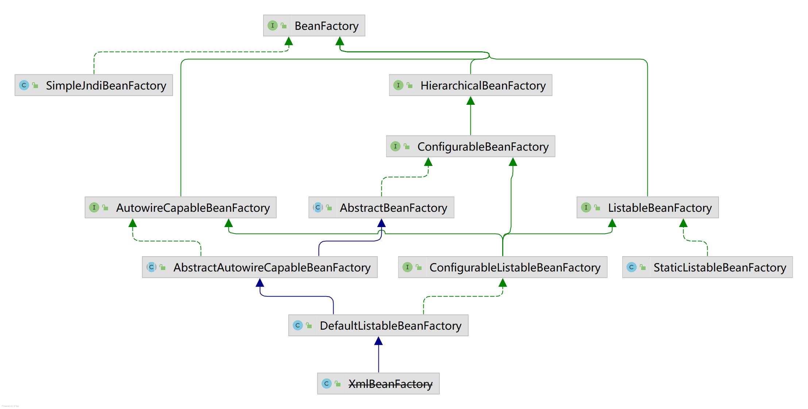
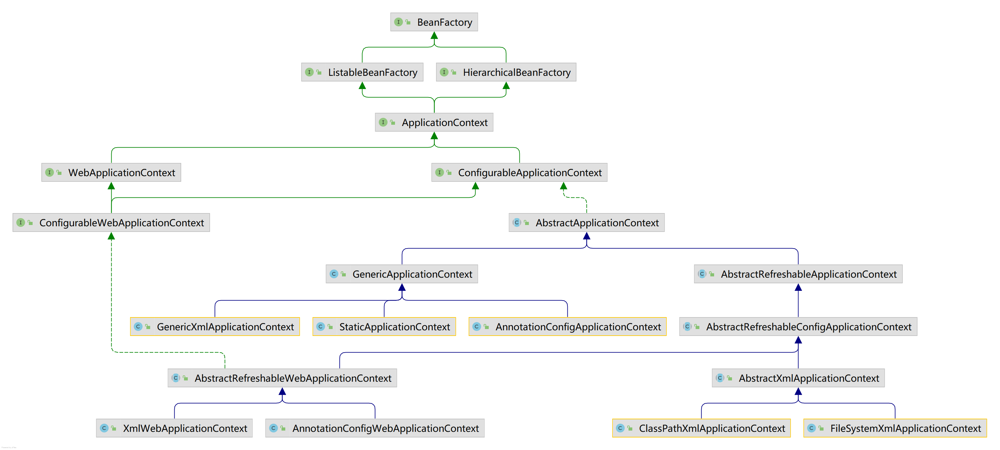

?> 注意：本文的主旨是理清 Spring 框架中的各种组件是什么？是干什么用的？更详细的说明应该查阅[官方文档](https://docs.spring.io/spring-framework/docs/current/reference/html/)。

Spring 为企业级应用提供了全面的模型，包括 IoC、AOP、Spring MVC、Spring Testing，还有一些关于任务、缓存、邮件之类的集成。

Spring IoC 和 Spring AOP 被他们叫做核心技术。

- 核心技术（Core technologies）：包含控制反转（Inversion of Control，IoC）和面向切面编程（Aspect-Oriented Programming，AOP）等特性，[IoC 也被称为依赖注入（Dependency Injection）](https://docs.spring.io/spring-framework/docs/current/reference/html/core.html#beans)
- 测试（Testing）
- 数据访问（Data Access）：事务管理，JDBCTemplate 等
- SpringMVC 和 Spring WebFlux
- 集成（Integration）：邮件、任务、日程、缓存之类的集成
- 语言（Languages）：Kotlin，Groovy，dynamic languages

本文将按照如下结构安排内容：

1. Spring IoC：见名知意。
2. BeanFactory 继承体系梳理：作为 Spring 的核心，有必要梳理一遍其继承体系。
3. ApplicationContext 继承体系梳理：作为一个 Spring 应用的核心，有必要梳理一遍其继承体系。
4. Spring AOP：见名知意。
5. Spring 其它核心技术：介绍除 IoC 和 AOP 之外的几种核心技术：资源、校验、数据绑定、类型转换、SpEL、Null-safty 和 日志。
6. Spring Test：测试模块，不做过多描述。
7. 数据访问支持：数据访问是 Spring 旗下一个非常庞大的体系，此节仅对比几个常用到的包。
8. SpringMVC：见《[SSM·SpringMVC](/SSM/SpringMVC)》。
9. 集成和语言：比较杂，不再此处描述。

## Spring IoC
控制反转这个名词乍一看容易把人唬住，说人话就是：原先编写代码，对象 A 如果需要用到对象 B 中的功能，那么它会自己创建对象 B。如果把对象 B 的创建交给 IoC 容器，那么就被称为控制反转，即**创建对象的控制权交给了别人而不是自己**。后来（2004）有人将 IoC 重命名为了依赖注入。可以参考这篇[文章](https://blog.csdn.net/ivan820819/article/details/79744797)。

IoC 容器的功能由 `BeanFactory` 实现，不过在应用中最常用的是其子类 `ApplicationContext`。这是因为它不仅提供了 **IoC 容器**的功能，还有**资源加载**、**事件发布**（仅包括上下文启动销毁事件和（web）请求处理事件）和**消息解析**（支持国际化）。这些都是一个应用程序比较常用的功能。

### bean 生命周期 vs 容器生命周期
自 Spring 2.5 开始，有以下三种方式配置 bean 的生命周期：

1. `InitializingBean` 和 `DisposableBean` 回调函数接口：Spring 容器会在合适的时候调用各自的方法。
2. 自定义 `init()` 和 `destroy()` 方法，然后在 xml 文件中配置。
3. `@PostConstruct` 和 `@PreDestroy` 注解。

> 在现代 Spring 应用中，JSR-250 的两个注解通常被认为是生命周期回调的最好方式。使用这些注解意味着你的 beans 不会和 Spring 的特定接口耦合。[来源](https://docs.spring.io/spring-framework/docs/current/reference/html/core.html#beans-factory-lifecycle)。官方不建议开发人员实现 `InitializingBean` 和 `DisposableBean`，没必要和 Spring 耦合。

如果为一个 bean 配置了多种生周期机制，且每种机制下的方法名都不一样，那么每个方法的运行顺序将按以下规则执行（初始化和销毁的运行顺序一致）。[如果名称相同，*说实话，没看懂官方文档说的是什么意思。*](https://docs.spring.io/spring-framework/docs/current/reference/html/core.html#beans-factory-lifecycle-combined-effects)

1. JSR-250 注解
2. Spring 函数式接口
3. 自定义的方法

令人疑惑的是，Spring 还有一个 `LifeCycle` 接口，它的名字就是“生命周期”。其实 `LifeCycle` 指的是容器的生命周期，而上述内容是 bean 的生命周期。来自[官方文档](https://docs.spring.io/spring-framework/docs/3.0.0.RC3/spring-framework-reference/html/ch03s06.html)。当容器启动时，所有实现 `LifeCycle` 的类会被 Spring 调用 `start()` 方法，其它方法略。那么有什么用呢？在容器启动时，我们可以用来创建数据库连接池；当容器停止时，我们断开连接。

### bean的作用范围
当你创建一个 bean 的定义时，即在 xml 中定义一个 bean 或用 java 代码，你就创建了一个 bean 的配方。通过该配方你可以创建许多对象实例。

你还可以控制一个 bean 的作用范围。Spring 框架提供了六种范围，其中四种只能在 web 环境中才有用。

1. singleton：默认，每个 IoC 容器仅有一个实例
2. prototype：任意多个
3. request：将 bean 的定义作用到一个 HTTP request 的生命周期，也就是说一次 HTTP 请求都有特定的 bean 实例（仅一个）。
4. session：与 request 类似，只是作用范围在 session 中
5. application：作用范围在 application
6. websocket：作用范围在 websocket

singleton bean：实例被存入缓存中，所有对该 bean 的后续请求以及引用直接返回该缓存对象。当容器被创建，bean 即被创建；容器在，则 bean 存；容器毁，则 bean 亡。

prototype bean：在每次请求时都会被创建一个新的 bean 实例。某种程度上，它是 new 操作符的一种替换。当调用 getBean() 时，bean 被创建；只要对象正在被使用，就会存活；当对象长时间不用，java 的垃圾回收器就回收它。

**注意**：当你需要在 singleton bean 中注入 prototype bean 时，prototype bean 只会被创建一次。如果你想要在 singleton bean 中总是获得新的 prototype bean，那么可以使用“注入方法”，即 `getBean()`。这里可能有点绕，什么叫“如果你想要在 singleton bean 中总是获得新的 prototype bean”，比如在 singleton bean 的每个方法被调用时，都需要不同的 prototype bean。

当然也可以自定义一个作用范围，需要实现 `org.springframework.beans.factory.config.Scope`。详见官方文档。

### 加载beans简单示例
本节记录如何使用 Spring 实现 IoC，方式有多种，主要介绍通过类路径中的配置文件和通过注解两种方式。

#### 通过配置文件加载beans
一、在任意一个 maven 项目的 pom.xml 中导入必要的包：

```xml
<dependency>
	<groupId>org.springframework</groupId>
	<artifactId>spring-context</artifactId>
	<version>5.0.5.RELEASE</version>
</dependency>
```

二、创建 Spring Context 的配置文件，其中可以定义各种 beans，文件名称是任意的，习惯称为 `applicationContext.xml`。将其放在 `resources` 文件夹下即可。

三、创建一个任意的 JavaBean 类，然后在 `applicationContext.xml` 中写入 

```xml
<bean id="beanName" class="com.xxx.xxx.UserService"></bean>
```

四、建立一个测试类，在其中创建上下文容器同时加载 `applicationContext.xml`。注意所谓的上下文容器其实就是 IoC 容器，也就是 bean factory。以下使用**类路径中的 xml 配置**创建上下文容器，然后调用某个功能。

```java
ApplicationContext app = new ClassPathXmlApplicationContext("applicationContext.xml");
UserService userService = (UserService)app.getBean("UserService");
userService.login();
```

五、如果想要直接在一个对象中注入另一个对象，可以在 xml 中配置：

```xml
<bean id="userService" class="com.xxx.xxx.UserService">
	<constructor-arg ref="userDao" />
</bean>
```

#### 通过注解加载beans
一、创建一个 javabean 并为其加上 `@Component` 注解。

二、在想要注入对象的属性上面加上 `@Autowired` 实现自动注入，可以使用 `@Qualifier("beanName")` 指定注入 bean 的名称。

三、在 spring 配置文件中配置组件扫描，让 spring 扫描这些 bean（注意这时不需要再写 `<bean>` 标签了）：

```xml
<context:component-scan base-package="xxx.xxxxx.xxx"/>
```

四、与上一节的操作类似，初始化 `ClassPathXmlApplicationContext` 对象。

#### bean的一些其它配置
- bean 的实例化方式
	+ 构造器方法：有参无参都可以，有参就用 `constructor-arg` 属性
	+ 工厂静态方法：利用 `factory-bean`、`factory-method` 属性
	+ 工厂实例方法：\_、\_
- 依赖注入：利用 constructor-arg 属性或者 property 属性（也可以 p:xxx）
- 懒惰加载：`lazy-init="true"`
- bean 生命周期配置
	+ init-method：初始化方法
	+ destroy-method：销毁方法
- 引入其它配置文件：`<import resource="...">`

### 资源加载
见 [Resources](#Resources)。

### Environment
`Environment` 接口被集成在容器中，它是两种关键应用环境的抽象：profies 和 properties。

### 事件发布
通过 `ApplicationEvent` 类和 `ApplicationListener` 接口，`ApplicationContext` 得以处理事件。如果一个 bean 实现了 `ApplicationListener` 且在上下文中，那么每次将事件发布到上下文时都会通知这个 bean。本质上是观察者模式。

?> 自从 Spring 4.2 开始可以使用注解方式，无需实现 `ApplicationListener`。

目前 Spring 仅提供了以下事件：`ContextRefreshedEvent`, `ContextStartedEvent`, `ContextStoppedEvent`, `ContextClosedEvent`, `RequestHandledEvent`, `ServletRequestHandledEvent`。详见[官方文档](https://docs.spring.io/spring-framework/docs/current/reference/html/core.html#context-functionality-events)。

### 消息解析——MessageSource
可用于国际化。

## BeanFactory继承体系梳理


1. `BeanFactory`：Spring bean 容器的根接口，持有一些 bean 定义的对象都应该实现它，例如 `ListableBeanFactory`。根据 bean 自身的具体定义，该接口会返回一个**单例**或**多例**作用范围的实例。自 spring 2.0 后还有一些新的作用范围，例如在 web 环境中的 request，session 等。此外，该接口还不会限制在哪定义 bean，可以在 xml、properties file 等位置。*总结自该接口注释的 1-5 段*。**总的来说，该接口定义了其所有实现拥有获取 bean 的能力。**
2. `HierarchicalBeanFactory`：实现该接口的对象可以被允许拥有父容器。如果没有在当前容器找到 bean，就会到直系父容器中寻找。容器中的 bean 应该总是覆盖父容器中的同名 bean。（总结自该接口注释，以及 `BeanFactory` 注释第 6 段）父子容器可以用于在某个上下文中隔离一些 beans，例如 WebContext 中的 bean 可能不想暴露给底层（service、dao）的上下文。
3. `ConfigurableBeanFactory`：由大部分 bean 工厂实现的配置接口。提供配置 bean 工厂的基础设施。定义这个接口并不是打算给常规的应用代码用的，对于典型的需求，请记住使用 `BeanFactory` 或者 `ListableBeanFactory`。这个扩展接口只是让框架内部即插即用。
4. `AutowireCapableBeanFactory`：让 bean 工厂拥有自动装配的能力。
5. `AbstractBeanFactory`：`BeanFactory` 的抽象基类实现，
6. `ListableBeanFactory`：实现该接口的 bean 工厂可以枚举它们所有的 bean 实例，而不是根据客户的请求用名字一个个地查表。需要预加载所有 bean 的 BeanFactory 可以实现此接口。此外，如果还实现了 `HierarchicalBeanFactory`，那么返回值不会考虑父容器中的 bean，返回值只与当前工厂中的 bean 有关。如果非要考虑，可以使用 `BeanFactoryUtils` 助手。**注意：除了个别方法，该接口其余方法都不是为了频繁调用而设计的。该接口的实现也许会很慢**。*总结自该接口注释的 1、2、4 段*。**博主注：实现该接口的 BeanFactory 拥有了枚举所有 bean 的能力，这样就可以根据提供的条件查询所有符合的 bean，例如查询所有被标注某个注解的 bean。不实现它的工厂只能用 bean name 到 map 中取。**
7. `StaticListableBeanFactory` 是静态实现，不具备绝大部分的能力，主要用于简单的独立项目。它能以编程的方式注册单例 bean。
8. `DefaultListableBeanFactory` 是 Spring 的默认实现，ApplicationContext 就是内置了这个工厂以此管理应用中的所有 bean。

## ApplicationContext继承体系梳理
下图是 `ApplicationContext` 的继承体系，包含 web 应用上下文。看起来十分复杂，其实不然。从上数第五层开始分为两种应用上下文：普通（`AbstractApplicationContext`）和 web（`WebApplicationContext`）。

图中大部分都是接口或者抽象类，一共有七个叶子结点，有两个类需要一提：`GenericXmlApplicationContext` 是处理 xml 文件的通用应用上下文，可以从任意地方读取，例如 url，从类路径或文件系统加载可以用其它两个更方便的类；`StaticApplicationContext` 支持以编程的方式注册 bean，而不是从配置源中读取 bean 的定义，主要用于测试。当然，web 环境中也有两个相似的类，不过没有在上图显示。

下面简述从 `ApplicationContext` 开始的所有类，内容分散在各小节。



1. `ApplicationContext` 为应用程序提供配置的**首要**接口（central interface），包括 bean factory、资源加载、事件发布和解析消息（支持国际化）。运行时只读，不过可以重新加载，如果其实现支持的话。*注意：该类的主要职责已经超越了 bean factory 的职责，为了实现“工厂”的功能，其内置了一个 BeanFactroy，默认是 `DefaultListableBeanFactory`*。
2. `ConfigurableApplicationContext` 是**绝大部分**应用程序上下文要实现的接口。除了 `ApplicationContext` 中必要的客户端代码，还提供了配置上下文的方法，故名“Configurable”。配置方法和生命周期方法被封装在了一起，这些现存方法仅在启动和关机时使用。可能会疑惑这里的接口为什么不直接由 `ApplicationContext` 实现？这是因为：
3. `AbstractApplicationContext` 是 `ApplicationContext` 的抽象实现，实现了通用的上下文功能，包括**资源加载**（默认继承`DefaultResourceLoader`；默认创建 `PathMatchingResourcePatternResolver`）、**事件发布**（默认 `SimpleApplicationEventMulticaster`）和**解析消息**（默认 `DelegatingMessageSource`）。此外，还实现了**生命周期**的处理和**环境**的创建。以上功能均内置了默认实例。注意：没有内置 BeanFactory，使用了模板方法设计模式，需要具体的子类实现抽象方法。
4. `AbstractRefreshableApplicationContext`：BeanFactory 可多次刷新，见 [ClassPathXmlApplicationContext](#ClassPathXmlApplicationContext) 一节。
5. `GenericApplicationContext`：BeanFactory 不可多次刷新，见 [AnnotationConfigApplicationContext](#AnnotationConfigApplicationContext) 一节。
5. web 环境：见 [WebApplicationContext](#WebApplicationContext) 一节。

### ClassPathXmlApplicationContext


1. `AbstractRefreshableApplicationContext` 是 `ApplicationContext` 的基类，**支持多次调用 `refresh()`**。通常，这种上下文由**一套**配置位置（config location**s**）驱动。子类唯一需要实现的是 `loadBeanDefinitions()`，每次刷新时方法会被调用。
2. `AbstractRefreshableConfigApplicationContext`：上面的子类，增加了处理配置位置的通用功能，例如设置、获取配置位置以及解析路径。它没有限定配置的类型，可以解析任意的配置，例如类路径、url 等。
3. `AbstractXmlApplicationContext`：使用 `XmlBeanDefinitionReader` 从 xml 中读取配置。
4. `ClassPathXmlApplicationContext`：从类路径中读取 xml 配置。

### AnnotationConfigApplicationContext
1. `GenericApplicationContext`：通用实现，内置一个 `DefaultListableBeanFactory`。与其他的 ApplicationContext 实现的区别是，**它只能调用一次 `refresh()`**。由于它不再是抽象类，并且需要注册 bean，所以还是实现了 `BeanDefinitionRegistry` 接口。*比较奇怪的是，注解驱动上下文继承了这个不可刷新的实现，而 Web 环境注解驱动上下文继承了另一个可刷新的实现。*
2. `AnnotationConfigApplicationContext` 属于独立应用程序上下文，顶层实现。由于它属于注解驱动，因此需要实现 `AnnotationConfigRegistry` 接口，其中包含 `register()` 和 `scan()` 两个方法。可以传入配置类然后用 `register()` 一个一个地注册，或者传入基本包字符串然后用 `scan()` 扫描。在多配置类的场景下，`@Bean` 修饰的方法会被后者覆盖。可以用这种特性覆盖 bean 的定义。

### WebApplicationContext
`WebApplicationContext` 定义了 `getServletContext()` 接口方法，其子类得以获得 servlet 环境。由于该应用上下文的构建逻辑与非 web 应用上下文类似，因此不再赘述。

## 不同的ApplicationContext有什么区别
应该区分配置定义（configuration definition）和 bean 定义（bean definition）。

[How many ways are there to configure the Spring framework? What are the differences between them technically? (Not pros or cons..)](https://stackoverflow.com/questions/35807056/how-many-ways-are-there-to-configure-the-spring-framework-what-are-the-differen?newreg=4ac64b0056564a44b84564c3f255c2e7)

## Spring AOP

## Spring其它核心技术
### Resources
Java 提供了针对多种 URL 前缀的处理器，然而它还是无法完全满足访问所有低级资源的需求，例如访问类路径（classpath），或者 ServletContext 的相对路径。为此，Spring 制定了 `Resource` 接口。

?> 这样说可能还是无法理解什么是 `Resource`。简单来说就是 Spring 不满意 java 提供的访问资源接口，打算另起炉灶。它的功能就是访问各种路径中的文件。  
注意区分 `Environment` 和 `Resource`，这两个可能容易搞混。`Environment` 是从文件中读取出来之后的配置，是用于整个应用程序的配置。

具体也没啥好说的，相当于是一个 Spring 的 io 包。Java 的 io 包应该不陌生，比如 `BufferedReader`，`Reader`，`InputStream` 等。

### 校验、数据绑定和类型转换
Spring 提供一套数据校验、绑定以及类型转换的功能。

实际上 java 有自己的一套校验标准：JSR-303，并且还有对应的实现。Spring 提供了一个  `Validator` 协议，可能是因为 JSR-303 发布于 2009 年，Spring 3.0 发布于 2009 年年末，Spring 还没来得及实现 JSR-303。数据校验详见《[业务逻辑·数据校验](业务逻辑/数据校验)》。

`DataBinder` 可以让用户输入动态地与应用中的领域模型绑定，或者是随便什么对象。`Validator` 和 `DataBinder` 组成了 `validation` 包，主要用于但不限于 web 层。

Spring 3 引入了 `core.convert` 包，它提供一个通用的类型转换系统。有字符串转数字，日期转换等便捷功能。详见《[业务逻辑·类型转换和格式化](业务逻辑/类型转换和格式化)》

### SpEL

### Null-safety

### 日志

## Spring Test
在 pom.xml 中导入必需的包：

```
<dependency>
	<groupId>org.springframework</groupId>
	<artifactId>spring-test</artifactId>
	<version>5.0.5.RELEASE</version>
</dependency>
```

## 数据访问支持
数据访问常用到 spring-tx，spring-dao，spring-orm，spring-jdbc 四个包，其中 **spring-dao** 是 spring-tx 的子集。spring-orm 实现了对象关系映射，其中集成了 hibernate 和 spring data jpa。JPA 是 java 制定的对象持久化接口，是 orm 的标准。Sun 公司希望能够整合 orm，所有 orm 都应该实现 JPA 标准。主流实现有之前提到的 hibernate 和 spring data jpa，此外还有 TopLink、OpenJPA、EclipseLink 等。orm 框架不建议编写 sql 语句。

有一个特殊的流行持久层框架没有实现 JPA，就是 MyBatis。它的思路与 orm 不同。它拥抱 sql 语句，属于 sql mapping 框架。

由于目前本人比较常用 mybatis 框架，就不具体介绍 **spring-orm** 了。注意区分 spring-orm.jpa（spring-orm 模块下的 jpa 包）和 spring-data-jpa（spring-data-jpa 模块）。*这一点对于理解 orm、jpa、spring data jpa、hibernate、mybatis 等之间的关系有很大帮助。spring-orm 模块下仅完成了 jpa 和 hibernate 的对象关系映射，而 Spring Data JPA 是真正的持久层框架，因此被放入 spring-data 模块中。注意：hibernate 是一个独立的框架，因此不在 spirng-data 中。至于 mybatis 它没有实现 jpa，都不是一个 orm 框架。*

**spring-jdbc** 是 spring 对 jdbc 的简易封装，用到的功能通常是：打开数据库、执行 sql 语句、关闭数据库。用的更多还是持久层框架，这里也不介绍 spring-jdbc。

**spring-tx** 提供事务管理的功能，全面的事务支持是使用 Spring 框架最令人信服的原因之一。

**注意：真正的数据访问位于 spring-data 包下，其体系十分复杂，不在此处记录。此外，理论上事务管理与 Spring 的关系不是很大，因此放在《事务管理》一章。**

## SpringMVC
见《[SSM·SpringMVC](/SSM/SpringMVC)》。

## 参考文献
1. Spring
	+ [浅谈 IOC--说清楚 IOC 是什么](https://blog.csdn.net/ivan820819/article/details/79744797)
	+ [spring 与 springmvc 父子容器](http://www.tianshouzhi.com/api/tutorials/spring)
3. 数据访问
	+ [MyBatis 不是完整的 ORM 框架？](https://www.zhihu.com/question/39454008)


