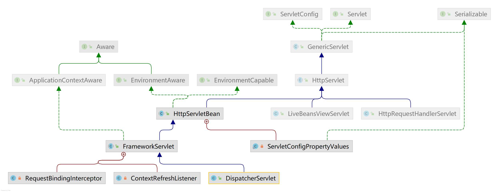
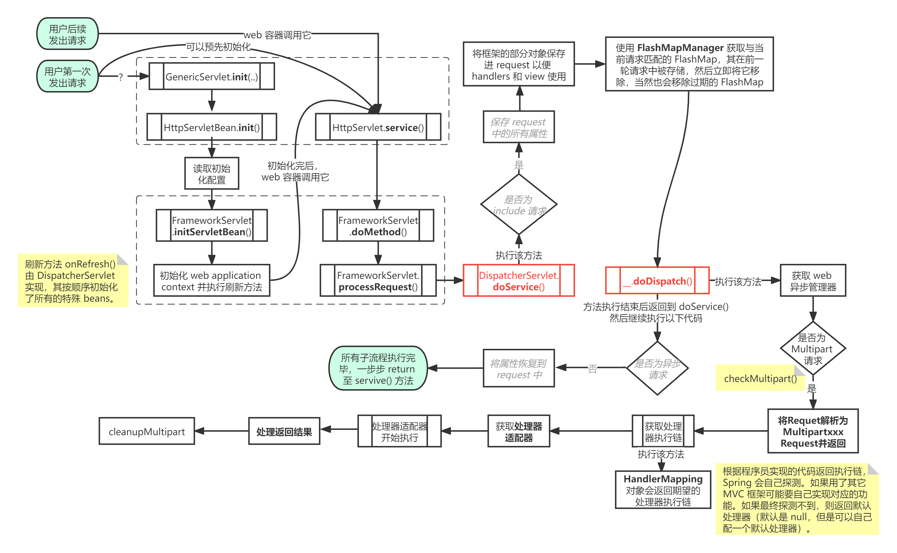

Spring Web MVC 是基于 Servlet api 构建的原始 Web 框架，从一开始就包含在 Spring 框架中。正式名称（Spring Web MVC）来自源码包名（`spring-webmvc`），不过更常被称为“SpringMVC”。

SpringMVC 提供的 **`DispatcherServlet`** 作为整个 web 应用的入口，扮演了至关重要的角色，因此很有必要了解它的运行流程。下面首先给出流程图，然后介绍其中的部分组件。

## 运行流程
以下是 `DispatcherServlet` 的继承关系，其中 `HttpServlet` 是 javax 的实现，它实现了 `Servlet.service()` 接口，提供了各种处理方法，例如 `doGet(), doPost(), doDelet()`……Spring 没有直接基于 `HttpServlet` 实现 Servlet，而是首先定义了抽象类。作为 `DispatcherServlet` 的抽象类，自然也有必要一探究竟。



`HttpServletBean` 是 `HttpServlet` 的简单实现，可以将其配置参数转为 bean 的属性，配置参数指的是 `web.xml` 里的 `init-param`，例如 `contextConfigLocation`。该类将请求的处理留给子类实现。该通用 servlet 基类不依赖 ApplicationContext，因为简单的 servlets 通常不需要加载它们的 context，而是可以调用工具类的方式更简便地获取 context，即 `WebApplicationContextUtils`。

`HttpServletBean` 中的 `init()` 方法首先会读取配置在 `web.xml` 中的初始化参数，然后使用内部类 `ServletConfigPropertyValues` 保存起来。在此之后就会调用 `initServletBean()` 执行初始化操作，一般就是创建 web application context。以上就是该类的主要贡献，除此之外还提供了设置环境的各种方法。

*注意：`init()` 由 `GenericServlet.init(..)` 调用，而 Servlet 估计由 tomcat 创建。具体代码暂时看不了。*

`FrameworkServlet` 是 Spring web 框架的基本 servlet。主要设置各种参数以及创建 `WebApplicationContext`。此外，`processRequest()` 还对请求进行了通用处理，包括国际化和发布事件。实际的处理需要由子类实现抽象模板方法 `doService()`。

`DispatcherServlet` 初始化了一系列的特殊 bean，其唯一主要方法是 `doDispatch()`，它的内部调用了初始化的各种 bean。

以下是 `DispatcherServlet` 的运行流程，由于流程与内置的 bean 高度相关，可以说它的执行流程几乎等价于执行所有内置 的 bean，因此内部的细节完全可以放在各个 bean 中探讨。详见下一节。



*值得注意的是：上述流程中有一个被称为 include 的请求，它指的是 `<jsp:include>`，由于现在 jsp 用的不多，所以基本可以无视。我在[此处](https://blog.csdn.net/it_freshman/article/details/81365000)了解到它。*

## 内置bean
`DispatcherServlet` 会委托一些特殊的 bean 去处理请求并且提供适当的响应。以下罗列了由 `DispatcherServlet` 探测的特殊 bean（且按如下顺序初始化）：

- `MultipartResolver`：文件上传
- `LocaleResolver`：国际化
- `ThemeResolver`
- `HandlerMapping`：将一个请求和一连串的拦截器映射为一个处理器，实际返回的是处理器执行链
- `HandlerAdapter`：处理器适配器，用于适配各种框架的处理器，例如 j2ee 的 Servlet，Spring 的 Controller 接口、Controller 注解、HandlerFunction 函数式接口等。
- `HandlerExceptionResolver`：异常处理器
- `RequestToViewNameTranslator`
- `ViewResolver`：视图解析器
- `FlashMapManager`

下面按照 `DispatcherServlet` 使用这些 bean 的顺序进行描述（与初始化顺序不同）。

### FlashMapManager
Spring 使用 `SessionFlashMapManager` 作为默认管理器，其继承关系十分简单，一脉单传。它主要用于管理 `FlashMap` 实例。

`FlashMap` 可以做到存储一个请求中的属性以便在另一个请求中使用。当从一个 URL 重定向到另一个时最为常用。具体来说，`FlashMap` 在重定向之前被保存下来，在重定向之后便可使用，然后立即移除。你可能会觉得，这不就是 session 的功能吗？我直接存在 session 里不行？**事实上 Spring 就是用 session 实现的**，不过它的作用范围更小，比 request 略大。它仅支持属性在一次重定向中使用，也就是两次请求。

有一点比较难以理解，那就是在 Controller 中并不会使用 `FlashMap`，而是使用 `RedirectAttributes`。[用法](https://zhuanlan.zhihu.com/p/21353217)如下所示，可以看到该类就是专用于处理重定向而设计的，第二种做法更安全。

```java
// 第一种做法
redirectAttributes.addAttribute("user", "zhangsan");
return "redirect:/index"; // url 变为“/index?user=zhangsan”，暴露了属性，不安全
// 第二种做法
redirectAttributes.addFlashAttribute("user", "zhangsan"); // 返回之后，spring 将“user”转存到 FlashMap 中，仅一次重定向中可用，更安全
return "redirect:/index";
```

难以理解的点在于，`RedirectAttributes` 实现了 `Model` 以便其可以被 spring 框架识别，但是为何不让 `FlashMap` 直接实现 `Model`？详见下图，完全可以把 `FlashMap` 放在 `RedirectAttributes` 的位置。


`DispatcherServlet` 大致按照以下流程使用 `FlashMapManager`：

一、任意用户在请求服务器时，都会先执行 `FlashMapManager`，再调用 `doDispatch()`。原因有二，其一是检索以及更新 `FlashMap`，其二在于它需要移除过期的 `FlashMap`，默认是 3 分钟。

二、在处理完用户的方法（一般来说就是标注 `@RequestMapping` 方法）之后，Spring 会创建 `ModelAndView`，然后渲染视图。在执行 `getModelAndView()` 时，如果模型属于 `RedirectAttributes` 的实例，也就是程序员在 Controller 中想要存储 `FlashAttributes`，那么该方法还会将模型中的所有 `flashAttributes` 存入位于 session 中的 `FlashMap`。`FlashMapManager` 本质上只是在管理位于 session 中的 `FlashMap`。

三、方法返回到 `doDispatch()` 之后，还会继续执行 `processDispatchResult()`。简单来说，它会渲染视图。如果视图是 `RedirectView`，Spring 会自动保存当前 url 到 `FlashMap`。等重定向后，可以调取 `FlashMap` 的 `targetRequestPath` 直接获取跳转之前的 url。当然，如果不知道这个功能，也可以自己把 url 设置到 `FlashMap`，自己设置的属性在 `targetRequestParams`。

**注意：开启 `<mvc:annotation-driven/>` 才能使用 `RedirectAttributes`，否则可以用 `RequestContextUtils` 直接从 session 获取 `flashMap`。**

### MultipartResolver
在执行所有方法以前，`DispatcherServlet` 会先检查本次请求是否在上传资源，是则 `MultipartResolver` 将 request 解析为 `MultipartHttpServletRequest`。

**值得注意的是：`MultipartResolver` 默认是关闭的，想要开启上传功能，需要自己配置解析器。**此外，如果开启该功能后，*似乎*只能使用 Spring 配套的组件获取文件。因为如上所述，request 已经被转换为了 Spring 自定义的 `MultipartHttpServletRequest`。

### HandlerMapping
`HandlerMapping` 可以定义请求与处理器（handler）对象之间的映射关系，其中 handler 指的是处理请求的处理器（例如 Controller 中处理请求的方法）。一个 handler 通常与其相关的 `HandlerInterceptor` 一起被包装进 `HandlerExecutionChain` 实例，然后交由 `DispatcherServlet` 使用。`DispatcherServlet` 在执行 handler 之前和之后都会调用拦截器，这其实就是所谓 Spring 拦截器的实现过程。

Handler 是一个比较复杂的定义，在以前的版本中所有控制器都需要实现 Controller 这个函数式**接口**，然后在配置文件中配置控制器的 bean，例如 `<bean id="/user_info" class="xx.xx.UserInfoController">`，注意 id 必须以“/”起始。**一个 controller bean 就是一个 handler。**这样做其实与实现 `HttpServlet` 类似，一个 Controller 对应一个 url。后来可以结合使用 `@Controller` **注解**和 `@RequestMapping`，一个方法对应一个 url。**一个方法就是一个 handler**，称为 `HandlerMethod`。此外，程序员可能会使用其它的 MVC 框架，甚至直接用原生的 servlet。

因此，正如 `HandlerMapping.getHandler()` 的注释所述，`HandlerExecutionChain` 中包含 handler 对象（指 java 的 Object 类），而不是一个接口，这样 handlers 就不会受到任何的约束。例如，可以重写 `HandlerAdapter` 以此使用其它框架的 handler。**这样可能还是有点不易理解，说白了就是：`HandlerExecutionChain` 包含 Object 类，而不是接口，这样 `DispatcherServlet` 就可以无限扩展。因为例如你甚至可以用 Struts 作为 MVC 框架，然后自定义一个 `StrutsHandlerAdapter`。如果其中包含的是接口，处理器适配器就无法工作了，因为 Spring 的接口怎么转成 Struts 的处理器？而 Object 是所有类的基类，所以可以随便强转。**

`HandlerMapping` 有两种常用实现：

1. `BeanNameUrlHandlerMapping`（简化版：`SimpleUrlHandlerMapping`）
2. `RequestMappingHandlerMapping`

前者用于 url 和 bean name 的匹配，后者用于 url 和 `@RequestMapping` 的匹配。后者比较容易理解，前者应该是以前的做法。以前实现一个控制器必须实现 `Controller` 函数式接口，一个 url 对应整个类。控制器必须在配置文件中被定义，其 bean id 就是 url，且只能以“/”起始。与 Struts 框架类似（url 对应 action name）。

### HandlerAdapter
处理器适配器（HandlerAdapter）用于适配各种处理器，思路是：Spring 调用处理器适配器，处理器适配器再调用处理器。这样 Spring 就拥有了**无限扩展**的能力。处理器（Handler）说白了就是处理用户请求的方法，例如：

```java
@GetMapping("/userInfo")
public UserInfo getUserInfo(Integer userId){
	return ...
}
```

Spring 实现了 `RequestMappingHandlerAdapter` 处理器适配器，它会调用 `getUserInfo()`。此外，还有一些实现。例如适配 Servlet 的处理器适配器，即适配 `doXxx(..., ...)`；适配 Spring 老版 Controller 的处理器适配器，即适配 `Controller` **接口**；适配函数式编程的处理器适配器，即适配 `HandlerFunction<>`。甚至，你要乐意，可以自己写一个 `StrutsHandlerAdapter` 与 Struts 适配。

### 异常集中处理
如果在请求中产生了异常，那么 `DispatcherServlet` 会委托异常解析器（`HandlerExceptionResolver` beans）链解决异常。

`HandlerExceptionResolver` 可以返回：

- 一个指向异常视图的 `ModelAndView`
- 如果在解析器中解决了异常，那么就返回空的 `ModelAndView`
- 如果异常无法解决就返回 `null`，让后面的解析器尝试解决；如果最后一个也无法解决，那么异常就给 Servlet 容器。

`DispatcherServlet` 会自动加载容器中存在的 `HandlerExceptionResolver` beans，根据 `order` 属性对所有解析器排序，值越大解析器越在后面。

Spring 提供了一个简单的异常解析器 `SimpleMappingExceptionResolver`，通过配置它可以根据具体的异常跳转到特定的视图，样例配置如下：

```xml
<bean class="org.springframework.web.servlet.handler.SimpleMappingExceptionResolver">
	<property name="defaultErrorView" value="error" /> <!-- 默认跳转 -->
	<property name="exceptionMappings">
		<map>
			<entry key="java.lang.ArrayIndexOutOfBoundsException" value="error.jsp" />
			<entry key="java.lang.NullPointerException" value="error.html" />
		</map>
	</property>
</bean>
```

除了上述简单的异常处理器，还包括以下几种：


### 视图解析
SpringMVC 定义了 `ViewResolver` 和 `View` 接口，使你在浏览器渲染视图时无需使用特定的视图技术。`ViewResolver` 提供了视图名称和真实视图之间的映射。下图展示了一些实现，可以发现 Spring 内置了许多视图技术。*Thymeleaf 由官方实现，Spring 没有内置。*


你可以定义不只一个视图解析器，它们会被串成一个链。如果有必要还可以设置 `order` 代表顺序。值越大解析器越在后面。*这可能适用于一个 web 应用中有多种视图的情况，例如 Thymeleaf 和 Freemarker 共存。*`ViewResolver` 如果返回 `null` 就代表它找不到视图。

## 拦截器
所有的 `HandlerMapping` 实现都能处理拦截器。当你想要对某一请求执行一些特定功能时，拦截器非常有用，例如权限检查。拦截器必须实现 `HandlerInterceptor` 接口及其三个方法：`preHandle()`，`postHandle()`，`afterCompletion()`。

*感觉它跟 Filter 差不多。*

## 使用SpringMVC搭建服务器简单示例
一、首先需要创建一些 bean，可以使用 xml，也可以是注解驱动，具体可以看《[Spring·加载beans简单示例](/SSM/Spring?id=加载beans简单示例)》。当然不编写 bean 也可以，毕竟只是一个示例。

二、由于使用 SpringMVC 的功能实现 web 服务器，而 Servlet 又是必需的，因此我们可以使用 SpringMVC 实现的强大的 Servlet——DispatcherServlet。此外 `DispatcherServlet` 还需要持有 Web 环境的 ApplicationContext，因此它还需要包含对应的 bean xml 配置文件。在 `web.xml` 中的配置如下：

```xml
<servlet>
	<servlet-name>DispatcherServlet</servlet-name>
	<servlet-class>org.springframework.web.servlet.DispatcherServlet</servlet-class>
	<init-param>
		<param-name>contextConfigLocation</param-name>
		<param-value>classpath:spring-mvc.xml</param-value>
	</init-param>
</servlet>
<servlet-mapping>
	<servlet-name>DispatcherServlet</servlet-name>
	<url-pattern>/</url-pattern>
</servlet-mapping>
```

三、`spring-mvc.xml` 包含 MVC 层的 bean 定义（例如 Controller），不过现在一般用注解标注 bean，所以只需要添加注解扫描代码即可：`<context:component-scan base-package="xxx.xxx.controller"/>`。当然也可以配置一些自定义的 bean，例如视图解析器、处理器映射器、处理器适配器等，Spring 提供了默认的实例。

如果需要实现 `@ResponseBody` 的功能，除了自己配置 bean，还可以在配置文件中加入 `<mvc:annotation-driven />` 实现一键配置。

注意：如果 DispatcherServlet 使用 "/" 路径，那么浏览器就无法访问静态资源了。可以通过以下配置解决：

```xml
<mvc:resources mapping="/js/**" location="/js/">
```

或者使用 
```xml
<mvc:default-servlet-handler />
```

代表找不到就用原始容器（即 tomcat）找资源。

四、对于非英语地区的开发者，还需要解决乱码的问题，可以通过配置过滤器解决：

```xml
<filter>
	<filter-name>CharacterEncodingFilter</filter-name>
	<filter-class>org.springframework.web.filter.CharacterEncodingFilter</filter-class>
	<init-param>
		<param-name>encoding</param-name>
		<param-value>utf-8</param-value>
	</init-param>
</filter>
<filter-mapping>
	<filter-name>CharacterEncodingFilter</filter-name>
	<url-pattern>/*</url-pattern>
</filter-mapping>
```

*注意：这似乎只对 post 请求有效。*

## 上传文件功能原理解析——Multipart
请看以下 Controller 示例：

```java
@PostMapping("/user/create")
public Result createUser(@Validated({ValidGroup.Insert.class}) @RequestBody User user){
		userService.createUser(user);
		return Result.success().tip4user(Tip4User.CREATE_USER_SUCCESS).data(user);
}
```

如果使用 Postman 请求该链接，其中 Body 设置成 form-data，那么 Spring 就会报警告，告诉你不支持 `'multipart/form-data;...;charset=UTF-8'`。这是因为 `@RequestBody` 注解实际上是告诉 Spring 你应该以 `ContentType='application/json'` 解析这个 url，也就是将 json 转化为 java 对象。自然就不支持 multipart 了。

解决办法实际上很简单，只要把 `@RequestBody` 删了，然后在参数列表中加入 `MultipartFile file` 参数用于接收文件即可。至于剩下的那个 java 对象，Spring 还是会帮你自动转化的。不过这样说挺抽象的，为什么 Spring 会帮忙自动转化？为什么在解析 json 数据的时候，不加 `@RequestBody` 不帮我自动解析？（*刚试了一下，其实不加注解，Spring 也会自动转化*）还是看 Spring 代码的运行流程比较好理解点。

之前说到 `DispatcherServlet` 会在 `doDispatch()` 方法中检查 request 是否为 MultipartRequest，而且该检查的优先级几乎是最高的，先于其它绝大部分内置 bean 执行。在 `checkMultipart()` 方法中打个断点，发现 Spring 真的执行到了这。在经过一些方法或 bean 的调用后，Spring 开始真正处理请求，对于基于注解开发的 SpringMVC 框架来说，就是处理被 `@RequestMapping` 标注的方法。

Spring 调用 `HandlerAdapter` 内置 bean 的 `handle()` 方法，该方法会再遍历地调用内置的多个 `HttpMessageConverter` 根据 content-type 检查是否可以被 converter 读取方法中的参数。在上述例子中，context-type 是 `multipart/form-data`，而方法中的参数却是一个被 `@requestBody` 标注的 java 对象，显然没有一个 converter 能够读取。随后判断没有读取成功，直接抛出 `HttpMediaTypeNotSupportedException` 异常。


## 参考文献
- 内置bean
	+ [【稀里糊涂学springmvc】FlashMap-FlashMapManager-RedirectAttributes](https://blog.csdn.net/liuhaibo_ljf/article/details/105952437)
	+ [springMVC ——Controller 配置方式](https://www.cnblogs.com/lyh233/p/12047942.html)


