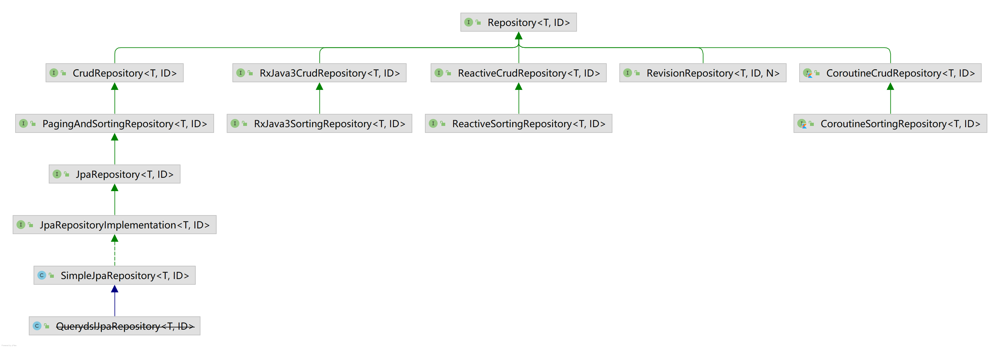

Spring JPA 实现了 jap 标准。虽然[官方文档](https://docs.spring.io/spring-data/jpa/docs/current/reference/html/#reference)已经介绍了如何使用 JPA Repositories，但是居然只字不提如何联表查询！网上对 JPA 实体的描述也十分零散，虽然 [JPA 官网](https://jcp.org/aboutJava/communityprocess/final/jsr338/index.html)提供了一份详细的文档，但是它长达 570 页！因此本文也记录了如何联表查询。

## 认识Repository
下面是 Repository 的继承关系，看最左边的 `CrudRepository` 类即可，右边的分别用于 RxJava、响应式编程 Reactor、记录数据的变更（RevisionRepository）以及 kotlin。值得注意的是 Spring 有一个独立的 `spirng-data-commons` 模块，`CrudRepository` 及其直接子类位于其中，而其余扩展全部位于 `spring-data-jpa` 模块。



`JpaRepository` 是对 jpa 技术的特定 Repository 实现，提供了持久化技术以及能够使用 Example 查询，类似的还有 `Neo4jRepository`、`MongoRepository`。`SimpleJpaRepository` 是该体系中的唯一实现类（其子类已被废弃），它是默认实现。如果在其中打入断点，你会发现你调用的接口最后都会进入该类的对应实现。例如调用接口方法 `findById()` 就会进入实现类的对应方法。因此，我们只需要继承我们想要的接口即可，不需要继承这个实现类。

如何理解 `JpaRepository` 提供了持久化技术？个人认为是因为它提供了一个 `flush()` 方法，通过这个方法，实现  `JpaRepository` 的类都可以手动地将其持久化到数据库。你可能要问用 `CrudRepository` 的 `save()` 也可以持久化到数据库，有什么区别？还是有点的。理论上 `CrudRepository` 的任何操作都无法持久化，只是在事务结束后，会自动执行 `flush()` 操作。而 `JpaRepository` 拥有手动持久化的能力，所以“它提供了持久化的技术”。*个人的看法：接口定义行为*。

以上涉及到实体的生命周期，感兴趣的可以参考页首提到的长达五百多页的官方 pdf 文档……

## 查询方式
Spring JPA 支持将查询手动定义为字符串或直接从方法名派生而出。虽然从方法名派生出一条查询很方便，例如框架会将 `findByLastName()` 方法名解析为 sql 语句，但是这可能会陷入窘境。要么方法名不支持某个想要用的关键字，要么名字太丑了。因此，还可以使用 JPA 命名查询（JPA Named Queries）或者在查询方法上标注 `@Query`。以下分别简单地介绍各种方法。

1. 使用 JPA 命名查询：这是 jpa 标准提供的方法，可以使用 `<named-query />` 或 `@NamedQuery` 创建一条 **jpa 查询语句**。当然也可以使用 `<named-native-query />` 或 `@NamedNativeQuery` 创建**原生 sql**。跟 mybatis 类似，就不细说了。*注意：在实体类上标注注解，然后通过 `name` 关联对应 Repository 中的接口方法。*
2. 使用 `@Query`：这是 Spring JPA 提供的注解。由于命名查询本质上是绑定一个 java 方法，因此实际上直接在接口方法上使用 `@Query` 就行了。有助于解放实体类。

基于上述的查询方式，Spring 还提供了一些便捷的功能：Sort、Named Parameters、SpEL Expressions。这些就不介绍了，基本上对所有框架都是通用的。

接下来，介绍更复杂的查询：联表查询以及利用命名实体图谱进行查询。

### 联表查询
Spring JPA 可以轻易地就执行联表查询，只需要在相应的字段上加上 @XToY 和 `@JoinColumn` 即可。这些注解的用法繁多，其注释中提供了许多样例。例如一本小说包含多卷，那么有

```java
@Entity
@Table(name = "tb_novel")
public class Novel implements Serializable {
	...
	
	@OneToMany
	@JoinColumn(name="novelId")
	private List<Volume> volumes;
}

@Entity
@Table(name="tb_volume")
public class Volume implements Serializable {
	// 注意：数据库中字段名是“novel_id”。
	private Integer novelId;
}
```

通过 `@OneToMany` 和使用 `@JoinColumn` 的 `name` 指定列名，就将小说及其所有卷建立了一对多关联。值得注意的是 `@JoinColumn` 的 `name` 虽然指的是列名，但它实际上是指 java 代码中所定义的列名。上例中数据表中字段名是“novel_id”，但 `name` 指定的是“novelId”。`@JoinColumn` 还可以指定表名，如果不指定就默认是所联实体的表，留意 `Volume` 类的 `@Table` 注解。

此外，当类定义位置加上 `@Entity` 注解后，Spring 将其视为数据表对应的实体，所有字段**必须一一对应**。如果删除 `volumes` 上的注解，idea 会报错。除非加上 `@Transient` 注解，告知 Spring 它不会被持久化。

不过上述构建关联的做法具有一定的缺点：**在查询小说信息时，总是会查询卷信息，浪费服务器性能**（这说法不是特别准确）。《[利用命名实体图谱进行查询](#利用命名实体图谱进行查询)》详细描述了如何解决以上问题，不过在此之前我们先了解一下前置知识：什么是 Eager 取回类型，什么是 Lazy 取回类型。

### 两种取回类型：Eager和Lazy

### 利用命名实体图谱进行查询
JPA 标准提供的一些注解可以让联表查询变得十分简单，但是它有如下两个问题：

1. 在上节的例子中，所谓的联表查询其实执行了两个 select 语句。Spring JPA 为什么不拼成一个？
2. 在上节的例子中，当指定表的关系之后，在查询小说时总是会附带查出所有卷的信息。能不能给个开关自由切换？我如果只想要小说的信息呢？

如果你本来就会用 Spring JPA，那么你应该知道上述的两个问题其实是同一个问题。我们可以使用懒加载解决第一个问题，然后使用命名实体图解决第二个问题。如果你是 Spring JPA 新手，那么可能很难理解以上的说法。可以参考下面的例子加以理解。在此之前先介绍一下基本概念。

<details>
<summary>基本概念（点击查看）</summary>

JPA 2.1 规范支持指定 FetchGraph 和 LoadGraph，在实体定义上标注 `@NamedEntityGraph` 即可指定一个命名实体图，为此 Spring 提供一个 `@EntityGraph`，让我们可以引用它。在一个实体上使用 `@NamedEntityGraph` 注解，就可以配置某个查询的取回计划；使用 `@EntityGraph` 的 `type` 属性可以配置取回的类型（`Fetch` 或 `Load`）。更详细的描述可以参考长度五百多页的官方文档的 3.7 节，下面是官方对实体图谱的解释。

> 实体图谱（Entity Graph）被用在查询操作的“取回计划”（fetch plan）这一规范中。如果在代码中对其命名，就称为命名实体图谱（Named Entity Graph）。  
> Entity graphs are used in the specification of “fetch plans” for query or `find` operations.

</details>

接下来通过一个例子解释如何进行特定的查询，即定制“**取回计划**”。下面分别是 Novel 实体类及其 Repository，小说拥有很多卷（`volumes`）和很多人物角色（`portraits`）。`@NamedEntityGraph` 在 `Novel` 类上定义了一个被称为“Novel.withVolume”的命名实体图谱，然后 Repository 的方法使用 `@EntityGraph` 引用该图谱。留意我的写法，`findById()` 是重写方法。

```java
import javax.persistence.NamedEntityGraph;
import javax.persistence.NamedAttributeNode;
@NamedEntityGraph(name = "Novel.withVolume", attributeNodes = @NamedAttributeNode("volumes"))
@Entity
@Table(name = "tb_novel")
public class Novel implements Serializable {
	...
	
	@OneToMany()
	@JoinColumn(name="novelId")
	private List<Volume> volumes;
	
	@OneToMany()
	@JoinColumn(name="novelId")
	private List<Portrait> portraits;
}

import org.springframework.data.jpa.repository.EntityGraph;
public interface NovelRepository extends PagingAndSortingRepository<Novel, Integer> {

    @EntityGraph(value="Novel.withVolume")
    @Override
    Optional<Novel> findById(Integer integer);
}
```

这样，service 在调用 `findById()` 时就会查询小说的信息及其所有卷信息，并且不查询人物角色。注意，**此时 jpa 不再使用两个 select 语句了，而是合并为一个（但这并不是 `@NamedEntityGraph` 注解的功劳）。**要解释这一点需要先知道：Repository 上的 `@EntityGraph` 注解可以指定 `type`，之前说过可以用它来指定取回的类型。总共只有两种：`FETCH` 和 `LOAD`，也即上文提到的 FetchGraph 和 LoadGraph。默认值 `FETCH` 才是实现以上功能的功臣，即只有一条 sql 和查卷而不查角色。**仔细观察 `FETCH` 的定义，有助于理解上例为什么没有取回 `portraits` 的数据。**友情提示：`@OneToMany` 的取回类型默认是 `LAZY`。助记：`@Basic` 默认是 `EAGER`。

1. `FETCH`：实体图谱中属性结点（attribute nodes）指定的属性被视为 `FetchType.EAGER`，没有被指定的属性要么是其本身的类型（在实体类中定义），要么是默认的 `FetchType`。
2. `LAOD`：实体图谱中属性结点（attribute nodes）指定的属性被视为 `FetchType.EAGER`，没有被指定的属性被视为 `FetchType.LAZY`。

显然，现在我们已经解决了第一个问题了，属性的取回类型设置为 `EAGER` 即可（巧用两种实体图谱类型可以更方便）。同时，第二个问题其实也解决了，只要指定想要取回的 `attributeNodes` 即可。

**不过又出来一个更大的问题：如果你自己测试一下上面的代码，你会发现它并不会生效。**这可不是 bug。懒加载的定义是当首次访问数据时才会去取回该数据，可不是不加载。不论是打断点调试还是直接返回到前端，你都会访问这个数据（debug artifact 会访问它；序列化的时候也会访问 get 方法），因此这个数据**被迫地**加载了。你可以发现 `portraits` 里的数据都是通过另一条 sql 语句查出来的，这正是它被访问的时候。因此解决办法是别访问它 :)。

那么问题来了，怎样才能不访问它？很简单，再创建一个 NovelWithVolumeDTO，其中不包含 `portraits` 属性。然后把数据复制一遍即可。最后返回 NovelWithVolumeDTO 实例。

## 级联更新和级联删除

## 存储过程

## Specifications
JPA2 引入了一个标准 api，可以程序化地构建查询语句。

## 通过样例查询

## 非实体查询——自定义复杂查询
如果想要在查询时指定具体的列名，这些列名可能横跨多张表，甚至是函数，例如 `count(*)`，这时该怎么做？比较容易想到的是使用 `@Query`，不过它只能构建一些比较简单的查询。当你的查询需要一些判断条件时，**例如 `where` 受用户输入的控制**，可以使用 `Specification`。因此，自然而然地想到可以组合使用它们。

然而不幸的是，[你并不能这样做](https://stackoverflow.com/questions/26379522/can-i-combine-a-query-definition-with-a-specification-in-a-spring-data-jpa-repo)。由于需要进行复杂的逻辑判断，因此你只能将 `@Query` 中的 sql 改写为更复杂的 `Specification`。当待查询的列名仅来自于 `Specification<T>` 的 `T` 实体（即数据表）时，是可行的。不过在前文已经说明了，我们想要查询的 sql 更为复杂。例如 `select a.name, b.avatar, count(*) from a, b where a.id = b.id and a.age > 18`，其中 `>` 受用户输入的控制。极为不幸的是，`Specification` 无法做到。[你无法在查询时指定列名](https://stackoverflow.com/questions/12618489/jpa-criteria-api-select-only-specific-columns/12702437#12702437)。此外 `Specification` 进行[多表查询](https://stackoverflow.com/questions/66451136/how-to-write-a-spring-boot-jpa-specification-joining-multiple-tables)也很复杂。

综上所述，**当你的查询需要指定列名并且需要一些判断才能构建 `where` 时**，你既不能使用 `@Query`，也不能使用 `Specification`。

## 选择性更新

## 锁
用 `@Lock`。太复杂了，不是三言两语能讲清的。官方文档里面也就用了半页稍微讲讲怎么用。

可以在本网站内搜索事务管理、锁等关键词。

## 参考文献
1. 查询操作
	- [JPA @Basic单表查询实现大字段懒加载](https://blog.csdn.net/weixin_37968613/article/details/100771942)
	- [JPA @OneToMany及懒加载无效问题](https://blog.csdn.net/R_o_b_o_t_/article/details/115400514)