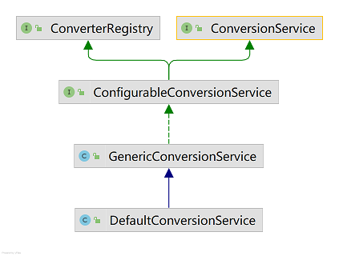

早在 Spring 1 就有了类型转换的功能，主要基于 `java.beans.PropertyEditor`。[2. Spring早期类型转换，基于PropertyEditor实现](https://zhuanlan.zhihu.com/p/334749955)

Spring 3 引入了 `core.convert` 包，提供了一种通用的类型转换系统。类型转换指的是不同 java 类型之间的转换，例如将 String 转成 Integer，将 po 转成 dto。此外，Spring 还提供了格式化的功能，位于 `context` jar 包的 `format` 包中。格式化只是更改格式，其可以被视为类型转换（type conversion）系统的一个子集。本章不描述格式化。

[Spring 官方文档](https://docs.spring.io/spring-framework/docs/current/reference/html/core.html#core-convert) 中介绍了该类型转换系统。知乎上有人整理了 [Spring 的类型转换](https://zhuanlan.zhihu.com/p/213809308)，可供参考。

Spring 提供了如下几种设计好的转换器接口。简单来说只是在方法内部接收一个源对象，然后返回一个目标对象。

1. `Converter<S, T>`：将源对象 `S` 转为目标对象 `T`。
2. `ConverterFactory<S, R>`
3. `GenericConverter`：通用转换器接口，可以在多个类型之间互相转换，灵活而复杂。通过一个方法可以指定该转换器能够转换哪些类型。
4. `ConditionalConverter`：暴露 `match()` 方法，令其它转换器只有在满足某个条件时才能转换。
5. `ConditionalGenericConverter`：顾名思义，继承了两个接口。如果想要实现通用转换器的功能，实现该接口即可。

*除了上述的转换器之外，Spring 还提供了 `ConvertingComparator` 类（转换时比较器）。它本质上是一个比较器（`Comparator`），但是在比较之前，会将参与比较的两个对象 `S` 转换为对象 `T`。*

如果想要实现一个类型转换功能只需要实现以上任意一个接口即可。在将转换器注册到 IoC 容器中之后，就可以在 Spring 项目中很方便地使用。不过这样做也有缺点。首先，如果一个类需要使用多个转换器，就会出现很多类似的代码，比如 `xxxConverter.convert(..., [...])`。其次，当增加或者删除转换器时，需要改动多处代码。**如果有一个类能够帮我们集中管理所有的转换器**，那么代码的复杂度以及耦合度均可以下降。

`ConversionService` 帮我们实现了这一功能。我们只需要调用 `cs.convert(obj, target.class)` 即可。

## ConversionService
`ConversionService` 的继承体系如下图所示：



`ConverterRegistry` 提供向类型转换系统中注册转换器的功能。`ConfigurableConversionService` 是空接口。

`GenericConversionService` 是基本的实现，满足大部分场景。`DefaultConversionService` 是一个默认实现，其中自动装配了大量的转换器，适用于大部分场景。

考虑到转换系统包含了多种不同的转换器，因此在 `ConversionService` 中定义了一些转换器适配器（即 `ConverterAdapter` 和 `ConverterFactoryAdapter`），用于适配不同的转换器。这样所有注册的转换器就能够通过一个 `Converters` 内部类统一管理。注意：由于所有的适配器都实现了 `ConditionalGenericConverter` 接口，因此 `Converters` 中的转换器都是 **`GenericConverter`** 的子类。

`ConversionService` 的内部逻辑相对简单，无非是通过实现 `ConverterRegistry` 接口对外暴露**注册转换器**的功能，同时实现 `ConversionService` 接口对外暴露**是否可转换以及转换**的功能。

之后，本节将 `ConversionService` 称为 `CS`。

### 注册转换器
正如上所述，`CS` 利用内部类 `Converters` 管理所有注册的转换器。管理逻辑是将一对源类 `S` 以及目标类 `T` 作为键，值存储的是所有匹配的转换器。

上述的键被封装为 `ConvertiblePair`，值被封装为 `ConvertersForPair`。键由转换器（或转换器适配器）的方法生成，其实就是对源类和目标类的简单封装。注意：一个转换器可以生成多个键，即键集合，因为通用转换器（`GenericConverter`）可以在多个类型之间相互转换。

具体来说，`GenericConverter.getConvertibleTypes()` 返回 `Set<ConvertiblePair>`。转换器适配器中的该方法只返回一对，即源类和目标类；通用转换器可能返回多对，例如内置的 `ByteBufferConverter` 可以转换 `(ByteBuffer, byte[])` `(byte[], ByteBuffer)` `(ByteBuffer, Object)` `(Object, ByteBuffer)`。

不难看出，一个转换器可以与多个 `ConvertiblePair` 相关联，而不同的转换器也可能会产生相同的 `ConvertiblePair`。它们是一种多对多的关系。

以下就是存储所有转换器的容器：

```java
Map<ConvertiblePair, ConvertersForPair> converters = new ConcurrentHashMap<>(256);
```


如果转换器返回的键是 `null`，就将转换器加入到全局转换器 `globalConverters` 中。这代表该转换器适用于所有的类型转换场景。

### 获得转换器
在类型转换之前，`ConversionService` 需要获得相应的转换器。它会先从内部的缓存中查找是否存在。如果不存在，再到 `Converters` 中查找，并将找到的转换器存入缓存中。

值得注意的是，缓存的实现使用的是 `ConcurrentReferenceHashMap`。它是一个使用软引用和弱引用（键值均可）的 `ConcurrentHashMap` 实现。

### 查找转换器
`Converters` 提供了 `find` 方法用于查找转换器，接收两个参数：源类和目标类的 `TypeDescriptor`。

查找转换器的逻辑符合直觉。首先获得源类和目标类的类型的层次结构。例如 `UserInfo` 的层次结构为 `[UserInfo.class, Serializable.class, Object.class]`。然后写两个嵌套 for 循环枚举所有可能的组合，以此查询注册的转换器。

注意观察 `Converters` 的存储结构，`ConvertersForPair` 实际上一个列表。也就是说对于一个 `S -> T` 的转换情况，可能存在多个转换器。

简单来说，转换器必须实现 `ConditionalConverter` 才能进行进一步的判断，即你到底想要哪个具体的转换器，否则只能返回位于列表前部的转换器。而且需要注意的是，你想要的转换器的前面的转换器如果没有实现 `ConditionalConverter`，它就会被立即返回。也就是说如果你想要使用上述接口进行额外的判断，就要保证列表中所有的转换器都实现了该接口。所以实现 `ConditionalConverter ` 接口还是挺重要的。

## 线程安全？
`ConversionService` 使用了大量的 JUC 工具。

```java
// GenericConversionService
Map<ConverterCacheKey, GenericConverter> converterCache = new ConcurrentReferenceHashMap<>(64);
// Converters
Set<GenericConverter> globalConverters = new CopyOnWriteArraySet<>();
// Converters
Map<ConvertiblePair, ConvertersForPair> converters = new ConcurrentHashMap<>(256);
// ConvertersForPair
Deque<GenericConverter> converters = new ConcurrentLinkedDeque<>();
```

## 简单示例
定义一个转换器。

```java
public class UserConverter implements Converter<User, UserInfo> {
    @Override
    public UserInfo convert(User source) {
        UserInfo target = new UserInfo();
        target.setGender(source.getGender() == 1 ? "男": "女")
        return target;
    }
}
```

定义配置类，创建默认的转换系统，并注册转换器。

```java
@Configuration
public class ConverterConfig {
    @Bean
    public ConversionServiceFactoryBean defaultConversionService() {
        ConversionServiceFactoryBean csfb = new ConversionServiceFactoryBean();
        Set<Converter<?, ?>> converters = new HashSet<>();
        converters.add(new UserConverter());
        csfb.setConverters(converters);
        return csfb;
    }
}
```

在想要使用转换系统的类中注入：`@Autowired private ConversionService cs;`。

## List[String]转List[Integer]
[ Using a ConversionService Programmatically](https://docs.spring.io/spring-framework/docs/current/reference/html/core.html#core-convert-programmatic-usage)


