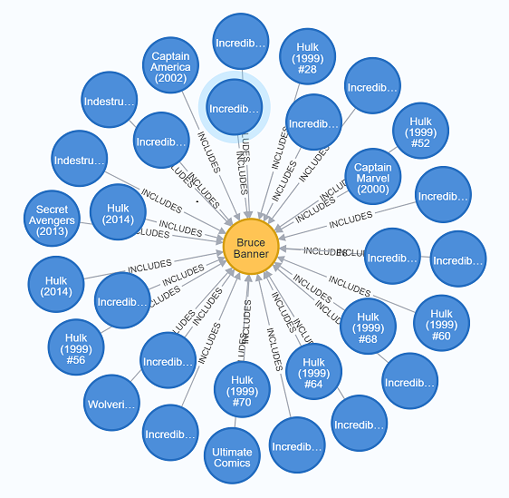
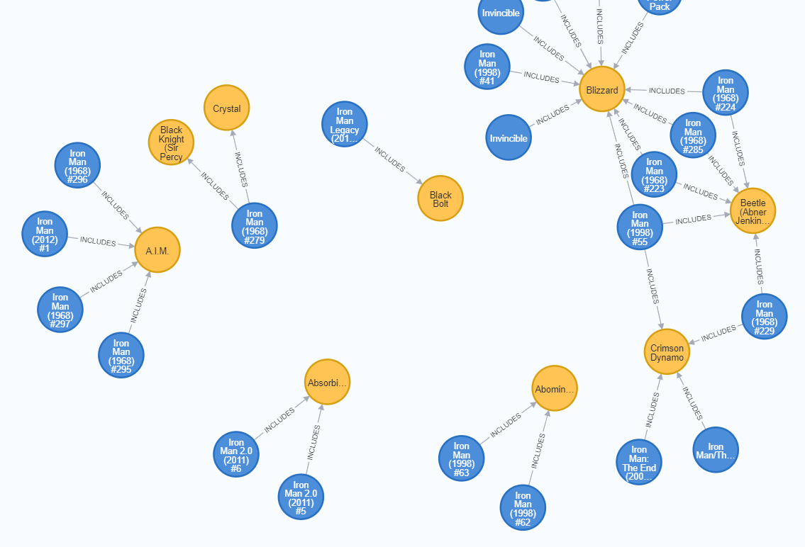
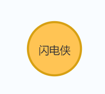
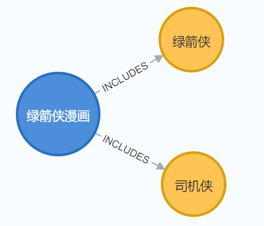

由于本系列不算是一个正规的教程，因此我不打算从基础内容开始讲解，而是直接上一个简单的项目。通过这个项目介绍 Spring Data Neo4j（下称 SDN） 和 Neo4j 的各种操作。

该项目已经上传到 [github](https://github.com/yan624/spring-neo4j-6-demo)。本系列后续会提供一个较为复杂的项目。

该项目的目标是建立漫威漫画的知识图谱，它的原作者是 [Jennifer Reif](https://github.com/JMHReif)，我直接从她的[仓库](https://github.com/JMHReif/sdn-marvel-basic)中下载。该项目起初仅有两种结点，分别是“角色”和“漫画”；仅有一个“包含”的关系。由于本系列是边写边完善代码，因此结点和关系的数量可能会有所变化。该项目的作者还提供了一个对应的[视频](https://www.youtube.com/watch?v=7Hms3EOImPw)。

!> 注意：本项目只是一个十分基础的样例，因此没有实现可视化，所有返回的数据均为 json 格式。此外，所有操作也都是普通的增删改查。

该项目的内容包括：

1. 介绍简单的 cypher 语句
2. 如何定义结点实体
3. 如何定义关系（`@Relationship`或`@RelationshipProperties`均可，二者均支持在保存结点时维护结点之间的关系）
4. 了解什么是静态的关系
5. 如何定义结点实体的仓库
6. 如何增删改查结点实体
7. 如何增删改查关系
8. 了解静态关系的缺点，然后提出动态关系。SDN 目前不提供操作动态关系的方法，可能未来也不会提供

## 图谱结构
漫威图谱的结构比较简单，如果想要查询某个角色在哪些漫画中出现过，可以使用以下语句：

```cypher
MATCH (com:ComicIssue)-->(ch:Character) where ch.name = "Bruce Banner" RETURN com, ch LIMIT 30
```

上述语句返回“Bruce Banner”出现过的所有漫画（限制返回 30 个结点），结果如下图所示：



如果你想要查询某部漫画出现过哪些角色，那么可以使用以下语句（注意一部漫画会有很多期，所以下图出现了不止一个漫画结点）：

```cypher
MATCH (com:ComicIssue)-->(ch:Character) where com.name =~ ".*Iron Man.*" RETURN com, ch LIMIT 30
```



## 结点实体定义
在 Spring Data 项目中，如果你想使用模板代码存储某个实体，那么你必须显示地在 java 代码中**预先**定义实体。在关系型数据库中，一张表就是一个实体，所以我们在实体类上标注 `@Table("tb_movie")` 就完成了定义。

!> 当我在写《关系定义》一节时，我发现从 SDN 6 开始，从定义上讲[关系不再是一个实体](https://community.neo4j.com/t/how-to-operate-the-relationship-alone/41614)。我不会修改《关系定义》之前的内容，但是之后的内容，不再称关系为实体。当然，下一段的表述“也可以持久化一个关系”也是错误的。SDN 不再支持为关系创建一个 Repository。

Neo4j 的实体有**两个**，分别是结点（node）和关系（relationship）。得益于 `Repository` 提供的模板代码，你既可以持久化一个结点，也可以持久化一个关系。关系可以看作是关系型数据库中的中间表。下面开始在 java 中定义漫威图谱的实体。

!> 注意：SDN 6 进行了重构，以下的代码可能与你在网上看到的内容不同。  
[Announcing Spring Data Neo4j 6.0](https://neo4j.com/blog/announcing-spring-data-neo4j-6-0/)

首先创建角色结点：

```java
@Node("Character")
public class Character {
    @Id
    @GeneratedValue
    private Long id;

    private String name, description, thumbnail;

    @Relationship(type = "INCLUDES", direction = INCOMING)
    @JsonIgnoreProperties("characters")
    private List<ComicIssue> characterComics = new ArrayList<>();
}
```

我们观察一下上述的定义。首先，使用 `@Node` 定义了一个结点，其中的值如果与类名相同可以不写。`@Id` 和 `@GeneratedValue` 定义了一个 neo4j id，如果在结点中本身有一个**属性**是唯一的，那么不需要标注 `@GeneratedValue`。**接下来请注意，`@Relationship` 注解标注了该节点通过某个关系（`INCLUDES`）与另一个结点相连。**`direction` 代表关系的方向，可以观察上面提供的图片，所有的关系都是指向角色的，这是入。需要注意以下两点：

1. 这种关系是静态的，观察代码你可以发现 `INCLUDES` 是写死在代码中的。
2. 一旦在代码中定义了这种关系，以后你只要使用 `Repository` 查询 `Character`，就一定会查询出 `characterComics`，哪怕你并不需要这些数据。

你可能已经感觉出点什么了，代码居然是写死的！万一一个结点不止一种关系呢？万一结点的关系在后续会新增呢？甚至是用户可以自定义关系呢？难道这个框架没有办法可以做到吗？我把上述的案例称为“动态关系”（Dynamic Relationship）。

很不幸，在查找了很多资料后，我暂时没有发现任何办法可以实现“动态关系”的功能。

其次，即使系统只有已知的关系，`Repository` 居然会帮我们直接加载预定义关系所连接的结点。如果你使用过 Spring Data JPA，应该知道它提供了一种 `FetchGrpah`，可以实现懒加载，定制取回计划（fetch plan）。难道 SDN 没有相应的方法吗？

很不幸，据 neo4j 员工的[回复](https://community.neo4j.com/t/lazy-loading-while-adding-new-relation/17159/4)，并没有，也没有计划引入。SDN 所做的查询就是你想要的（建模好的实体）。索性你还可以退而求其次，在实体中完全不定义这种关系。如果某些业务方法想要获得所连接的结点，那就使用 Spring Data 提供的映射（projection）功能。

接下来，我们定义漫画结点：

```java
@Node
public class ComicIssue {
    @Id
    @GeneratedValue
    private Long id;

    private String name, thumbnail;
    private Integer pageCount;
    private Double issueNumber;

    @Relationship(type = "INCLUDES")
    @JsonIgnoreProperties("characterComics")
    public List<Character> characters = new ArrayList<>();
}
```

这没什么好说的，可以看成是 `Character` 的反向定义。

我打算将关系实体的定义放在最后再讲，因为它是我计划写这一系列文章的直接原因。我不想放在这扰乱大家的思路。

## 结点仓库定义
在定义好实体之后，我们就需要定义数据访问层了，也就是常说的 DAO 层。在 Spring Data 中，它被称为仓库（Repository）。

由于 `Repository` 本身提供了模板代码，因此本小节比较轻松。我们分别定义 `CharacterRepo` 和 `ComicRepo`：

```java
public interface CharacterRepo extends Neo4jRepository<Character, Long> {}
public interface ComicRepo extends Neo4jRepository<ComicIssue, Long> {}
```

在想要访问数据时，只需要注入对应的 `Repo` 即可。由于本系列并不是 Spring Data 的教学，因此我并不打算详解 `Repostory`，此处仅介绍 `Neo4jRepository` 是什么。`Neo4jRepository` 是 `Repository` 的子接口，它提供了 CRUD、分页和样例查询。前一个泛型代表这个仓库管理哪个实体，后一个泛型代表所管理实体的主键是什么类型。在使用到具体的方法时，我会附上简短的说明。

由于本项目比较简单，因此下一节直接描述控制器的定义。

## 控制器定义
首先定义角色的控制器：

```java
@RestController
@RequestMapping("/characters")
public class CharacterController {
    private final CharacterRepo characterRepo;

    public CharacterController(CharacterRepo characterRepo) {
        this.characterRepo = characterRepo;
    }

    @GetMapping
    public Iterable<Character> findAllCharacters() {
        return characterRepo.findAllCharacters();
    }

    @GetMapping("/{name}")
    public Character getCharacterByName(@PathVariable String name) {
        return characterRepo.getCharacterByName(name);
    }
}
```

还记得之前说过 SDN 没有懒加载吗？事实上，`Repository` 有 `findAll()` 方法，它是模板方法，可以查询出该 `Repository` 管理的所有实体。由于在结点实体类中定义了关系，因此它会查出暂时不想要的 `CommicIssue` 对象。为此，我们自己定义了 `findAllCharacters` 方法。在对应的接口中加入以下代码即可。你可以试着把关系从结点实体中移除，然后调用 `findAll()`。

```java
@Query("MATCH (c:Character) RETURN c;")
Iterable<Character> findAllCharacters();
```

具体的代码可以在 github 中找到。在你启动项目后，在浏览器访问 http://localhost:8080/characters/Bruce%20Banner ，应该可以看到一小堆 json 数据。

漫画控制器的定义也是进行类似的操作。你可以一边看 github，一边看本文。有些代码不会出现在文章中。

## 增删改结点实体
到目前为止我们仅能做到查询结点，接下来将实现“增删改”操作。注意你们所创建实体的 id 可能与我的不一致，在使用下方提供的数据时，请先检查 id。

### 新增
由于 `Repository` 提供了 CRUD 模板代码，因此只要编写如下代码，就可以保存结点实体。

```java
@PostMapping
public Character createCharacter(@RequestBody Character character){
		return characterRepo.save(character);
}
```

我们使用 postman，向“/characters”发送 post 请求，并附带如下数据：

```json
{
	"name": "闪电侠",
	"description": "快就完事了"
}
```

在 neo4j desktop 中使用 cypher 语句 `MATCH (c {name: "闪电侠"}) RETURN c` 查询，我们可以看到操作成功了。



### 修改
`Repository` 并没有更新的方法。如果想要更新直接调用 `save` 即可，如果已存在待保存的实体，那么会更新属性（如果属性变化了）；如果不存在，那么就创建。代码略。

我们使用 postman，向“/characters”发送 put 请求，并附带如下数据：

```json
{
	"id": 9240,
	"name": "闪电侠",
	"description": "Run Barry, run."
}
```

`id` 指定了我们想要修改的结点。如果不携带 `id`，SDN 会创建一个新的“闪电侠”结点。

### 删除
我们可以根据 id 删除一个结点，如下所示；也可以通过传入对象使用 `delete(character)` 删除一个结点。

```java
@DeleteMapping
public Boolean deleteCharacter(Long characterId){
		characterRepo.deleteById(characterId);
		return true;
}
```

我们使用 postman，向“/characters”发送 delete 请求，并附带如下数据：

```json
{
	"id": 9240,
	"name": "闪电侠",
	"description": "Talk Man"
}
```

即使结点的属性与数据库中结点的属性不一致，也能够删除。因为这取决于 `id`。

### 新增三元组
我们在定义实体时还定义了对应的关系，因此有理由相信，在创建实体时如果附带了所连接的结点，`Repository` 会帮我们自动创建三元组，即级联新增（cascade）。

考虑到一部漫画可以包括多名角色，为此我们使用 `ComicController` 实现以上想法。加入以下代码：

```java
@PostMapping
public ComicIssue createTriples(@RequestBody ComicIssue comicIssue){
		return comicRepo.save(comicIssue);
}
```

我们使用 postman，向“/comics”发送 post 请求，并附带如下数据：

```json
{
	"name": "绿箭侠漫画",
	"thumbnail": "Oliver Queen is alive.jpg",
	"characters": [
		{
			"name": "绿箭侠",
			"description": "You have failed this city!"
		},
		{
			"name": "司机侠",
			"description": "Green Lantern"
		}
	]
}
```

我们使用如下 cypher 语句进行查询：

```cypher
MATCH (com {name: "绿箭侠漫画"})-->(ch) RETURN com, ch
```



### 修改三元组
既然可以保存三元组，那能不能修改三元组的信息呢？我也不知道，让我们试一下吧。使用 postman，向“/comics”发送 put 请求，并附带如下数据：

```json
{
	"id": 9240,
	"name": "绿箭侠漫画",
	"thumbnail": "Oliver Queen is alive.jpg",
	"characters": [
		{
			"id": 9242,
			"name": "绿箭侠",
			"description": "You have failed this city!"
		},
		{
			"id": 9243,
			"name": "司机侠",
			"description": "We need to talk."
		}
	]
}
```

图片就不放了，事实证明是可行的。

### 删除三元组
如果传入如下数据并使用 `delete(comicIssue)`，就会删除“绿箭侠漫画”这个结点，不会删除关联的结点。也就是说没有级联删除。值得注意的是，SDN 在删除结点时，使用的是 `DETACH DELETE`。如果只使用 `DELETE`，neo4j 会报异常，因为“绿箭侠漫画”与两个结点有关联。

```json
{
	"id": 9240,
	"name": "绿箭侠漫画",
	"thumbnail": "Oliver Queen is alive.jpg",
	"characters": [
		{
			"id": 9242,
			"name": "绿箭侠",
			"description": "You have failed this city!"
		},
		{
			"id": 9243,
			"name": "司机侠",
			"description": "We need to talk."
		}
	]
}
```

## 关系定义
终于要定义关系了。我之所以将关系放在最后，是因为它的定义很令人费解。SDN 禁止我们 CRUD 关系。这使得我们根本无法动态地维护关系。你可以将 SDN 定义的关系视为一个封装关系属性的简单 java 对象，例如定义 `Includes` 类。

```java
@RelationshipProperties
public class Includes {
    @RelationshipId
    private Long id;

    @TargetNode
    @JsonIgnoreProperties("characterComics")
    private Character character;

    // 你还可以为关系类自定义一些属性，此处省略。
}
```

`@RelationshipProperties` 将类表示为存储关系属性的对象，`@RelationshipId` 等价于同时使用 `@Id` 和 `@GeneratedValue`，`TargetNode` 将一个实体标注为目标结点，`@JsonIgnoreProperties` 代表忽略实体中的 `characterComics` 属性，否则会出现循环引用。

该类相当于定义了如下结构：`(?)<-->(target)`，注意箭头是双向的，这意味着目标结点既可以是起点也可以是终点。`(?)` 需要定义在具体的结点中，我们修改一下 `ComicIssue` 结点：

```java
@Node
public class ComicIssue {
    @Id
    @GeneratedValue
    private Long id;

    private String name, thumbnail;
    private Integer pageCount;
    private Double issueNumber;

    @Relationship(type = "INCLUDES")
    public List<Includes> includes;
}
```

现在三元组的关系就很明确了，我们得到了 `(:ComicIssue)-[:Includes]->(:Character)`。注意现在的箭头是单向的，因为定义已经编写完毕。（`@Relationship` 默认是出，如果你想定义反向的关系，那么将 `direction` 设置为 `INCOMING` 即可）

你可能会想这跟《结点实体定义》一节中的类定义有什么区别？之前不是也是上述的这种关系吗？区别是你现在可以获取关系中的属性了。例如你可以在关系中加入“登场时间”的属性。一本漫画拥有一个特定角色，但是该角色不会只出现在一本漫画中，“登场时间”无论存储在漫画还是角色结点中都不合理。

## CRUD关系
?> 在阅读本节之前，我建议先阅读 《CRUD实体会产生哪些cypher语句》。这是因为本节的内容比较反直觉，很有必要先理解 SDN 为我们做了什么。

目前 `Includes` 不包含任何属性，下面只进行简单的测试。首先使用如下语句，查询一下数据库中哪些漫画拥有比较多的角色吧。

```cypher
MATCH path = (com:ComicIssue)-->(ch:Character) where size((com)-->()) > 8 return path
```

我选择了“X-Men: Alpha (1995) #1”。在浏览器输入访问“/comics/X-Men:%20Alpha%20(1995)%20%231”，即可得到漫画及其相关联的 10 个角色。

还记得之前说过 SDN 禁止我们创建关系的 `Repository` 吗？想要建立结点之间的关系，只能依靠结点实体及其仓库。其实在《增删改结点实体》一节中已经介绍过了，本节使用修改过的结点实体再演示一次。接下来将建立“绿箭侠漫画”和“闪电侠”的关系。

使用 postman 对“/comics”发起 post 请求，并携带如下数据，注意数据格式与之前略有不同。

```json
{
	"id": 9245,
	"name": "绿箭侠漫画",
	"thumbnail": "Oliver Queen is alive.jpg",
	"includes": [
		{
			"character":{
				"id": 9241,
				"name": "闪电侠",
				"description": "Nice try. Gah! Ah! What, you shot me?"
			}
		}
	]
}
```

震惊！数据库中“绿箭侠漫画”的所有关系都不见了！包括之前保存的“绿箭侠”和“司机侠”。

!> 上面我们测试了查询和新增的操作，其它的操作类似，不再赘述。我想要指出，同时你可能已经发现的是：`save` 方法没有按预期执行。不是我不想解决这个问题，而是压根没法解决。据我所知这是 SDN 的设计，目前全网的讨论很少。我看见几篇在质疑这种设计的提问。就目前而言（`SDN 6.2.0`），我的建议是不要在操作结点时创建关系以及关系属性。
