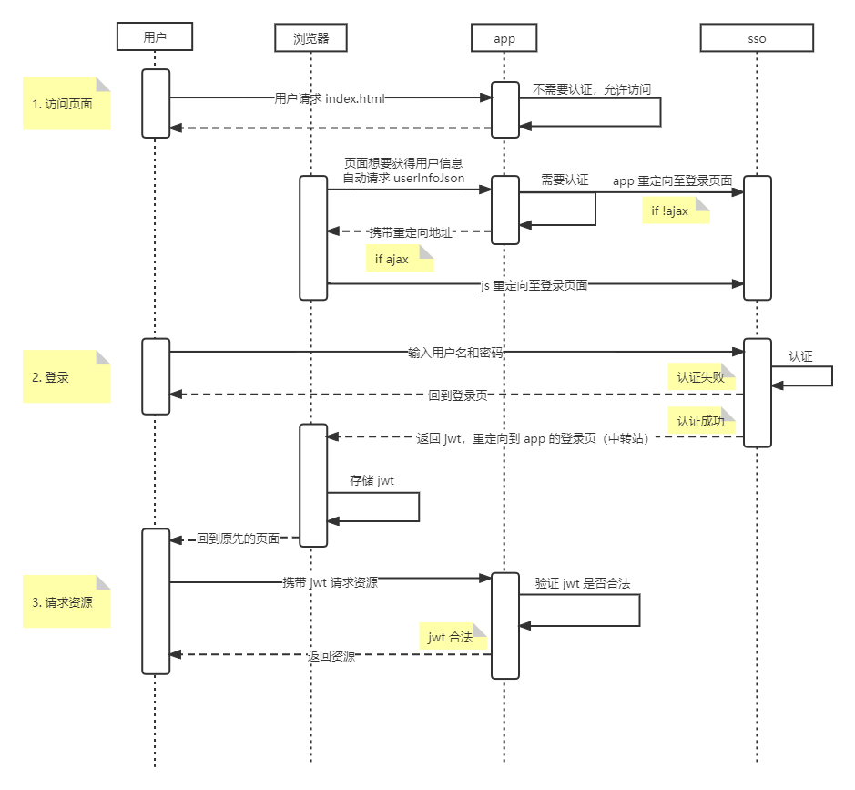
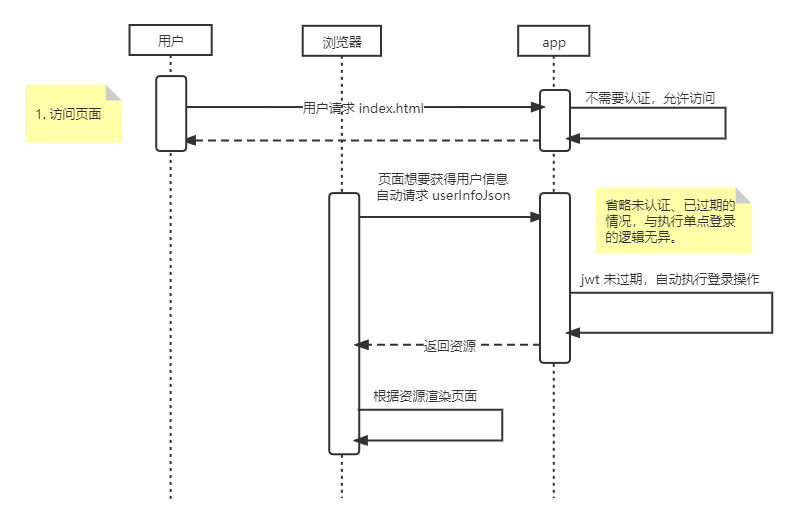

项目地址：[simple-shiro-jwt-springboot](https://github.com/yan624/simple-shiro-jwt-springboot)

## 特性
1. 使用 [shiro](https://shiro.apache.org/) 作为认证框架。
2. 利用 [jwt](https://jwt.io/) 实现单点登录功能。
3. shiro-jwt-sso 作为无状态服务器。
4. shiro-jwt-app 作为有状态服务器，存储用户的 jwt。
5. 利用 shiro 新特性，100 行代码实现 shiro-jwt 逻辑。（相对于网络上其它教程，具有更简单的逻辑）

## 你需要哪些前置知识
1. [SpringMVC](https://docs.spring.io/spring-framework/docs/current/reference/html/web.html) `@Controller` 以及 `@RestController`
2. [Spring Boot](https://spring.io/projects/spring-boot)
3. [shiro](https://shiro.apache.org/) 基本操作
4. [jwt](https://jwt.io/) 基本概念
5. 了解什么是跨域

## 用户请求时序图

### 用户未登录执行单点登录


### JWTFilter
待办

### 用户已登录但app意外重启
注意：用户不需要做额外的登录，因为 jwt 存储在用户的浏览器中。app 重启不会影响用户的登录凭证。



## shiro实现无状态服务器
在调用 `subject.login()` 后，shiro 会为用户创建一个其自定义的 session。如果是 web 环境，它实际上就是在内部持有一个 `HttpSession`。具体在 `DefaultSecurityManager#login()` 方法中的 `createSubject()` 创建。

想要让 shiro 不创建 session，我们只需要为所有 url 配置 shiro 内置的 `noSessionCreation` 过滤器即可。不过在调用 `subject.getSession()` 时会报错，这是因为这个方法的逻辑是，如果当前 session 是 null，就创建 session。而你却又配置了禁止创建 session 的过滤器，所以它很矛盾，就报错了。解决方法是使用 `subject.getSession(false)`。shiro 内部正是使用了它。因此不用担心 shiro 会报错。**注意：authc 过滤器除外，可能还有其它过滤器也会报错。**

由于我们使用 jwt 就是想实现无状态服务器，因此一般也不会调用 `subject.getSession()`。只要记住在配置 `noSessionCreation` 后，`getSession()` 返回的是 `null` 即可。

## 实现令牌刷新功能
试想你的驾驶证过期了是否等同于你的驾驶证失效了？显然不等价。驾驶证过期之后补办一张就行了（即刷新令牌），并不需要重新参加考试（即输入账号和密码）。

想要实现实现令牌刷新功能还需要一个额外的令牌——refresh token。本文实现参考了 [JWT refresh token flow](https://stackoverflow.com/questions/27726066/jwt-refresh-token-flow) 以及 [RFC6749#Refreshing an Access Token](https://datatracker.ietf.org/doc/html/rfc6749#page-47)。简单来说，用户在请求资源时，前端带上 access token 请求头。如果 access token 过期了，那么就携带 refresh token 并利用 ajax 向 sso 请求刷新 access token。在得到新的 access token 后，把它保存在本地并用该刷新的令牌请求后端资源。

access token 的过期时间一般很短，refresh token 反之。例如 15 分钟和 1 个月。

在实现令牌刷新功能时，应交由前端实现具体逻辑。如果返回 `true` 则代表允许用户请求资源，否则将用户重定向到单点登录页面。判断逻辑如下所示：

1. access token 或 refresh token 为空。返回 `[false, 0, '']`。
2. access token 已过期，refresh token 未过期。请求刷新。
	- sso 刷新成功，更新 access token 并返回 `[true, 200, refreshed access token]`。
	- sso 刷新失败，返回 `[false, 500, '']`，向用户提示错误信息。
3. refresh token 已过期。清空 refresh token 以及 access token。返回 `[false, 2, '']`。
4. 否则，返回 `[true, 1, access token]`

- 0 代表两个 token 中任意一个为空，需要重新登录。
- 2 代表 refresh 已过期，需要重新登录。
- 1 代表两个 token 均不为空，可以请求资源。
- 200 代表刷新令牌成功，可以请求资源。
- 其它代表 sso 服务器异常，需要重新登录。
	- 404 代表无该请求路径
	- 500 代表服务器错误
	- ……

有没有 js aop？可以用这个技术让每个方法执行前强制执行以上流程。

## 排坑指南
**如何禁用 session？** 使用 `noSessionCreation` 拦截器即可。

**如何处理跨域问题？**app 重定向至 sso 时，涉及到了跨域问题。在 sso 端需要配置允许哪些域名访问自己。

**为什么明明没有让 shiro 某个请求，shiro 还是拦截了？**可能是 spring 干的。如果将 Filter 注册为 bean，那么它不光归 shiro 管，也归 spring 管。

**既然是无状态服务器，用户怎么登出？**实际上你确实无法主动让令牌失效，毕竟令牌保存在用户本地。不过用户在请求登出时，直接让前端把令牌从用户本地删了就行了。

**代码似乎有 bug，用 js 验证 token，为什么过期时间失效了？** 注意 jwt 所存储时间的单位是**秒**，而 java 的时间单位是**毫秒**。在 java 中验证 jwt 时没有问题，因为 `java.util.Date` 会自动补上三个 `000`。虽然这与我们设置的过期时间不同，但是最多也就相差 1 秒，我们看不出差别。然而，当使用 js 时一切都变了。js 将过期时间（或者其它时间）解码出来时，其单位是**秒**！js 没有帮我们做特殊的处理。所以正确做法是自己手动乘 1000。

### 单点登录系统
**为什么网络上的教程这么复杂？**据我所知，他们把登录功能和 jwt 认证功能合并了。本项目将二者拆分，实现单点登录功能。

**如何将令牌回传给应用系统？**首先尝试了在用户登录单点登录系统（下简称 sso）后重定向回应用系统（下简称 app）的做法，具体逻辑是：1）app 拦截用户请求，如果该请求需要认证，就将他引导至 sso 的登录页面，其中附带返回链接（`backUrl`）。2）用户在登录页面输入用户名密码，sso 认证通过后生成 jwt，然后将 jwt 放入响应头并重定向至 `backUrl`，代码如下所示。3）app 接收响应头中的 jwt，并通知前端存储在用户本地电脑。4）以后用户发起需要认证的请求，都需要带上 jwt。

```java
resp.addHeader("Authorization", "Bearer " + jwt);
resp.addHeader("content-type", "application/json");
resp.sendRedirect(backUrl);
// return "redirect:" + backUrl;
```

实践证明，上述做法不可行，有两个问题。其一，重定向无法将响应头传给其它系统，原因可能是：当你发送一个重定向请求后（302 响应），“浏览器”会查看 `Location`，然后向该位置发送一个新的请求。由于这个请求是自动的，因此你的响应头丢失了。见 [How to pass new header to sendRedirect](https://stackoverflow.com/questions/34972006/how-to-pass-new-header-to-sendredirect)。其二，即使接收到了 jwt，app 怎么通知前端？这似乎在实现上就不可行（websocket 可能可以，但没试）。

为此改用了折中的做法：1）app 拦截请求，附带回调链接（`loginUrl`）以及返回链接（`backUrl`）。2）sso 生成 jwt 后调用 `loginUrl`，并且携带 `backUrl` 参数和 `jwt` 参数。3）`loginUrl` 是一个静态页面（中转站），里面的逻辑是：获得两个参数，存储 `jwt` 到本地，然后立即重定向至 `backUrl`。注意 `backUrl` 不一定是用户请求的 url，比如用户在 `user.html` 请求了 `deleteUser`，那么 `backUrl` 是 `user.html` 而不是 `deleteUser`。可以自定义具体的逻辑，例如只允许重定向回主页。

### 应用系统
**为什么明明没有为所有 url 配置自定义的过滤器，却还是发生了过滤？** 因为 Spring 管理了 Filter，它绕过了 shiro。解决办法有两个：要么[主动 new，而不是让 Spring 创建 Bean](https://blog.csdn.net/qq_44836294/article/details/107669575)；要么[设置成让 Spring 创建 Bena 但不让它管理](https://www.pianshen.com/article/957276428/)。本文选择第二种，因为第一种的配置比较繁琐，需要写大量无用的额外代码。下面补充一个例子。

假设我们有如下配置：
```java
chainDefinition.addPathDefinition("/post/**", "anon");
chainDefinition.addPathDefinition("/**", "jwtFilter");
```

如果不用上述的解决办法，那么“/post/\*\*”仍旧会被过滤。我们现在知道了这是 Spring 干的。如果使用了以下配置，那么 Spring 其实不会过滤。*暂时不知道为什么。*

```java
chainDefinition.addPathDefinition("/post/**", "anon");
chainDefinition.addPathDefinition("/user/**", "jwtFilter");
```

**在哪加上判断 jwt 是否过期的逻辑？** 见下条。

**拦截用户请求的逻辑是什么？** 我的逻辑是：1）判断 jwt 是否过期或不合法。如果是则直接进入步骤 2；否则执行 shiro 的逻辑，即查看是否已认证等操作。2）查看是否为登录请求，即有无携带 jwt 请求头，是则进行登录认证，认证失败或者不是登录请求都跳转至 sso 登录页面。*注意：通过配置 `/xxx=jwtFilter`，让 shiro 判断是否执行以上拦截逻辑。*

**不要以输入链接的方式访问被 jwtFilter 过滤的页面，你可能会得到一个疑惑的结果。** 因为你直接在地址栏输入 url，不会携带 jwt 请求头，所以无法认证。app 只能引导你去登录页面。你可能会感到奇怪，明明我登录了，为什么还要我登录，是不是代码有 bug。

**你可能会被重定向到一个奇怪的 url，比如 http://localhost:8081/null。** 仔细检查系统中需要重定向的代码，目前仅在三处：`login.html`, `index.html`, `JWTFilter#onAccessDenied()`。

**app 因意外重启了，用户还需要重新去 sso 登录吗？** 即使重启系统也无所谓，因为系统检验用户未认证后，会自动利用 jwt 帮他登录（代码在 `JWTFilter#onAccessDenied() executeLogin()`）。前提是你必须携带请求头。一般页面都会有 ajax 请求用户信息，由于请求用户信息是绝对需要认证的，因此需要携带请求头。应该能覆盖绝大部分场景。

**多签发者问题：应用系统可以得到 QQ 和微信签发的 jwt，怎么处理多个令牌？** 显然用户在一个时间只能用一个第三方系统登录，所以不需要额外处理该问题。

**已经配置了跨域，却还是不行？** Console 显示无法跨域并提示“Redirect is not allowed for a preflight request”。最后发现是 shiro 拦截了请求，并重定向到了登录页面。配置 `"/refresh": "anon"` 即可。

## 参考文献
1. [手牵手带你整合Shiro+JWT实现认证功能](https://blog.csdn.net/weixin_41896463/article/details/110003340)
2. [JSON Web Token 入门教程](https://www.ruanyifeng.com/blog/2018/07/json_web_token-tutorial.html)
3. [jwt 官网](https://jwt.io/)
4. [java-jwt 库](https://github.com/auth0/java-jwt#decode-a-token)
5. [关于ajax请求后在过滤器中需要重定向，前端页面不能正常跳转的解决办法](https://blog.csdn.net/feixiangzaitianye/article/details/94747820)