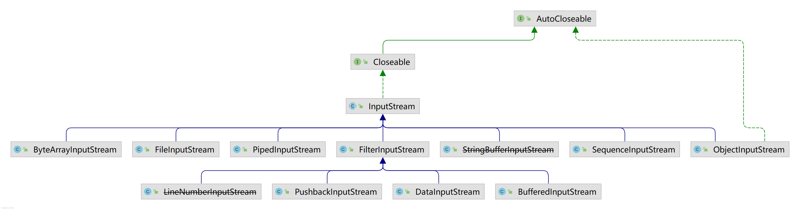
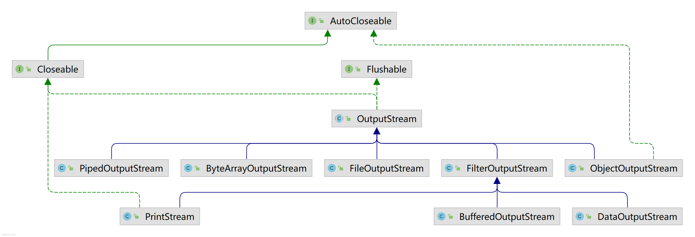
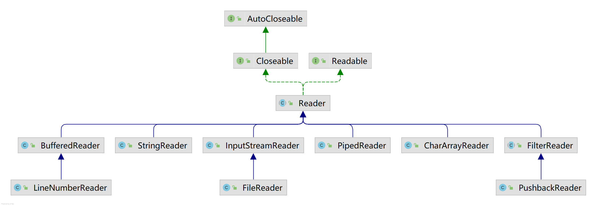
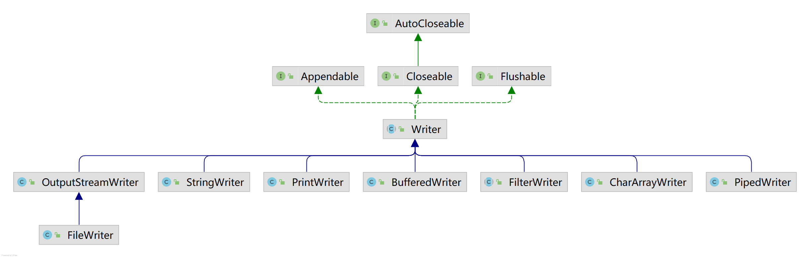
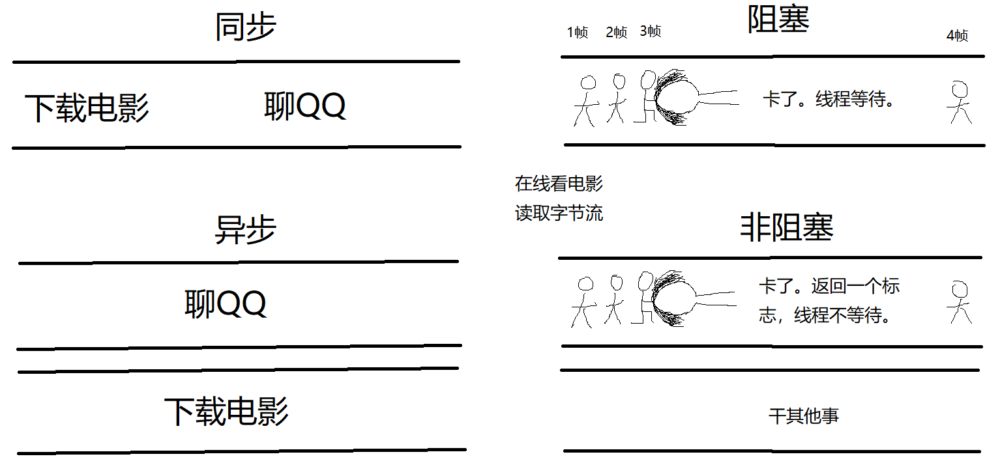

## 字节输入流

`ByteArrayInputStream` 内置一个字节缓冲区，可能读取自字节流（stream）。该类可以方便开发者读取从别处拿来的字节数组，它本质上并不是一个 IO 流。

`FileInputStream`：读取文件字节流，包括文本文件、图像等。如果要读取字符流，考虑使用 `FileReader`。值得注意的是，`InputStream` 定义的 `read()` 方法其返回值是 `int` 类型。按理说读取的是字节，返回 `byte` 就行了。这是因为：返回的字节范围是 0 - 255（详见接口方法上的注释），而 `byte` 的范围是 -128 - 127。因此这是冲突的。

`PipedInputStream` 应该与一个 piped output stream 相连，然后它会将字节数据写到 piped output stream 里面。通常，读入 PipedInputStream 的数据来自某个线程，写入 PipedOutputStream 的数据来自另一个线程。不推荐在同一个线程内使用这两个对象，因为可能会死锁住线程。

`SequenceInputStream` 表示其它输入流在逻辑上的一种拼接形式。它先从顺序集合中读取第一个，直到文件末尾；然后读取第二个，直到文件末尾；以此类推，直到读完。

`ObjectInputStream` 反序列化 `ObjectOutputStream` 写入的对象。

`FilterInputStream` 包含一些其它的输入流，将其作为基本的源数据，可能会沿途转换数据或者提供一些额外的功能。

`PushbackInputStream` 为其它输入流增加了“push back”或者“unread”一个字节的功能。

`DataInputStream` 允许程序以一种无关机器的方式从输入流中读取原生的 java 类型。

`BufferedInputStream` 为其它输入流增加了缓存输入的能力并且还支持 mark 和 reset 方法。

## 字节输出流
很多都是望文生义。略。

## 字符输入流
很多都是望文生义。略。

## 字符输出流
很多都是望文生义。略。

## 阻塞非阻塞同步异步
[Java NIO：浅析 I/O 模型](https://www.cnblogs.com/dolphin0520/p/3916526.html)

## NIO
[20 个问题带你轻松理解 java 中的 NIO 和 IO 到底是什么区别？](https://zhuanlan.zhihu.com/p/378926635)

