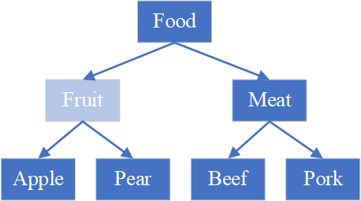

## 为什么ArrayList用的多，LinkedList用得少？
ArrayList | LinkedList
----------|-----------
基于数组，内存连续 | 基于链表，内存不连续
访问快 | 访问慢
尾部插入和删除的性能较好，其余部分较差 | 首尾插入和删除的性能较好，其余部分较差
数组占用内存较少 | 链表占用内存较多

综上所述，ArrayList 相对要好很多。可以看出 LinkedList 比较擅长需要操作靠近数据头部和尾部的场景。

1. ArrayList 适合修改元素以及在尾部增删元素。LinkedList 适合在首尾增删元素。

2. 访问 ArrayList 中的数据比较快，访问 LinkedList 中的数据比较慢。

## List、Set、Map和Queue的区别
1. List：有序列表，存储的元素既可以相同，也可以不同。
2. Set：无序集合，存储的元素只能不同。
3. Map：存储键值对
4. Queue：队列，能够按照特定的顺序存取元素。

为什么说 list 是有序的？set 是无序的？

因为数据在 list 中是插入的顺序，而数据在 set 中是乱序的，与插入顺序无关。

## 讲讲List、Set、Map和Queue？
与上类似，可以再附带讲一下它们的具体实现。

## ArrayList的扩容机制？
ArrayList 的初始大小是 0，一旦加入元素就直接扩大到 10，或者扩大到加入元素的数量。**当元素数量大于容量时，就扩大 1.5 倍。**

源码是 `int newCapacity = oldCapacity + (oldCapacity >> 1);`，右移一位相当于除以 2，也就是说 `x + 0.5 x = 1.5 x`。

具体的移动数据的方法比较简单，源码就是

```java
elementData = Arrays.copyOf(elementData, newCapacity);
```

## 优先队列

## poll()方法和remove()方法的区别？
当队列为空时，poll()返回null，remove()抛出异常。

## HashMap的扩容机制？
HashMap 的默认容量是 16，默认加载因子是 0.75，默认阈值是 12。

HashMap 的初始大小是 0，当第一次加入值时，才会扩容到 16。

当元素数量大于阈值的时候，就开始扩容，将数组扩大一倍。

在往新的 HashMap 中复制元素的时候，因为容量扩大了一倍，所以就相当于二进制的左边多了一位。

只需要将**哈希值**和**新容量**做（位）与运算即可，即可计算出新位置。

这种做法不会改变大部分元素的位置，只是会移出一些原本哈希冲突的元素。

-----

**答的时候，例子不用举。** 参考[HashMap 的扩容机制](https://zhuanlan.zhihu.com/p/114363420)

例如，原始哈希地址是 5，并且已知默认容量是 16，那么哈希地址的二进制就是 0101。

现在容量扩大了一倍，那么就是五位二进制，也就是说变成了 00101。

在以前，对于 21 这个哈希值，它会被取模，最终变成 5。也就是说两个对象的哈希值虽然不同，例如 21 和 5，但是取模之后哈希地址是相同的。

但是现在容量扩大了一倍，21 就不需要被取模了，那么二进制就是 10101。

发现了吗？00101 和 10101，只有首位不同。原地址 5 + 原容量 16 正好等于现地址 21。

那么具体是怎么存入哈希表的呢？其实只需要做与运算即可，因为哈希值不止有 5、21，还可能有 37、53……

```
5 & 32 = 00101 & 11111 = 00101
21 & 32 = 10101 & 11111 = 10101
37 & 32 = (1)00101 & 11111 = 00101
53 & 32 = (1)10101 & 11111 = 10101
```

## 为什么hashmap扩容时2倍

## 为什么做与运算就能计算出新位置？
因为 hashmap 容量扩大了一倍，这就相当于容量对应的二进制的最左边多了一位。

这样在做计算时，除了最高位，其它位的计算结果是不会变化的。这样的话大部分元素的位置是不会有变化的，部分哈希冲突的元素会被移到新开辟的空间。

可能是因为复制数据比较方便，因为 hashmap 底层本质上是一个数组。

**因为与运算相当于就是取模，可以把元素分布在哈希表内。**

## 为什么HashMap大于阈值才扩容而不是具体的容量？
这实际上问的是加载因子有什么用。

因为元素数量在接近容量时，哈希冲突会经常发生。所以需要一个阈值，减少哈希冲突。

## HashMap的初始容量是多少，为什么要是2的幂
HashMap的初始容量是 16。主要是为了保证减少哈希冲突的次数。

2 的幂意味着容量的二进制的每一位都是 1。

在扩容时，可以将哈希值和新容量做与运算得到新的哈希地址。在做与运算时，参与运算的各个位置可以保持原样不变。

比如说，0 和 0 做与运算结果是 0；0 和 1 做与运算，结果还是 0。这样就把原本不同的值改成一样了。

而 1 和 0 做与运算结果是 0，但是 1 和 1 做与运算，结果是 1。这样就保证了在运算之后，值是不变的。

------

例如我有一个数组，其中有 5 个数。也就是说哈希表的大小时 5。

现在想把对象映射到这个 5 个位置上，那么可能会在这 5 个位置上发生哈希冲突。

而如果和 0 做与运算，那么这个 5 个位置中的某些位置可能永远都不会被用到，例如说有一个位置永远不会被用到。

这样，这些对象只会在 4 个位置上发生哈希冲突。也就说哈希冲突的概率变大了。

## HashMap的存储原理？
HashMap 本质上是一个基于 Node 类型的对象数组，Node 中存储的是 hash 值和键值对。

在存储的时候，

如果 hash 值相同，并且 equals 方法也返回 true，那么就说明两个对象是相同的，这样只会更新对应的值。

如果 hash 值相同，但 equals 方法返回 false，那么就说两个对象是不同的。

因为它们的 hash 地址相同，所以 HashMap 会用链表的形式将它们串联起来。

当链表中的元素大于 8 时，就将链表转为红黑树；当红黑树中的结点小于等于 6 时，就转回链表。

```java
binCount >= TREEIFY_THRESHOLD - 1
```

**不过如果当前数组的长度小于 64，那么会先扩容，而不是转换成红黑树。**

如果 hash 值不同，那么意味着它们一定是不同的对象。不过，虽然 hash 值，但具体的地址还是可能会冲突。这时也会被加入链表或者红黑树里。

（java hashCode 规范规定：如果两个对象相等，那么 hash 值一定相同。那么逆否命题为：如果 hash 值不同，那么两个对象必定不同）

## 为什么用红黑树而不是avl树？
[记一次腾讯面试：有了二叉查找树、平衡树（AVL）为啥还需要红黑树？](https://zhuanlan.zhihu.com/p/72505589)

因为向哈希表中存入数据的操作比较多，当发生哈希冲突的时候，就需要把数据放到一棵树里面。对红黑树做插入操作的速度要快一点。

## hashmap在序列化和反序列化为什么需要重写 writeObject、readObject？
[为什么HashMap要自己实现writeObject和readObject方法？](https://zhuanlan.zhihu.com/p/84533476)

因为不同的 JVM 实现不能保证对于同一个key，所产生的哈希值是一致的。因此不能用默认的实现。

自己的实现，在 readObject 时可以重新计算哈希值，得到一个新的哈希表。

## HashMap和LinkedHashMap的区别？
LinkedHashMap 也是用哈希表存储数据，与 HashMap 唯一的区别是，它使用双向链表维护数据插入的顺序。

也就是说在遍历数据时，数据是有序的，是插入的顺序。而 HashMap 是无序的。

## HashMap,HashTable,ConcurrentHashMap,SynchronizedMap的区别？
HashMap 线程不安全；HashTable、ConcurrentHashMap、SynchronizedMap 线程安全。

ConcurrentHashMap 局部加锁；SynchronizedMap全局加锁。

ConcurrentHashMap 的键值都不允许是 null。

HashTable 是哈希表的另一种实现，由 jdk1.0 引入。

如果不需要线程安全，就用 HashMap，而不是 HashTable；如果需要线程安全且高度并发，就用 ConcurrentHashMap，而不是 HashTable。


## 讲讲ConcurrentHashMap？做了哪些优化？
[还不懂 ConcurrentHashMap ？这份源码分析了解一下](https://www.wdbyte.com/2020/04/jdk/concurrent-hashmap/#_1-concurrenthashmap-1-7)

[助力面试之ConcurrentHashMap面试灵魂拷问，你能扛多久](https://zhuanlan.zhihu.com/p/355565143)

ConcurrentHashMap 将哈希表分成多个 Segment，默认是 16 个。线程在访问 Segment 时只会锁定那个 Segment，其它线程还可以同时访问 ConcurrentHashMap 的其余部分。也就是说 ConcurrentHashMap 支持 16 个线程并发。（这是 java 1.7 的做法）

有些方法需要锁定这个 map，例如 `size()`，`isEmpty()`。

java 1.8 做了一些优化。

ConcurrentHashMap 与 HashMap 的结构差不多，不再使用 Segment，而是使用自旋锁和 CAS 保证线程安全，在添加数据的时候还使用了 `synchronized` 来局部加锁。

在初始化哈希表时，使用了自旋锁和 CAS 技术。它们保证在同一个时间内只能有一个线程初始化哈希表。

`sizeCtl = -1` 就代表有线程正在初始化哈希表。

`sizeCtl = -(1 + 正在调整哈希表大小的线程)` 代表正在调整哈希表的大小。

`sizeCtl > 0` 指的是扩容阈值，也就是容量大小乘加载因子（0.75），ConcurrentHashMap 源码中表示为 `sc = n - (n >>> 2);`，右移两位。

在存放值的时候，`synchronized` 用来锁定哈希表中某个位置的头结点。

这样就保证了多线程并发，因为在同一时间内，只锁住了哈希表中的一个位置，其他位置是不上锁的。

删除也是锁定首结点。

**ConcurrentHashMap 还使用了 volatile 关键字保证数据的可见性。**

## ConcurrentHashMap的键值为什么不支持null？

**键的角度**


**值的角度**

[Why does ConcurrentHashMap prevent null keys and values?](https://stackoverflow.com/questions/698638/why-does-concurrenthashmap-prevent-null-keys-and-values#:~:text=The%20main%20reason%20that%20nulls,maps%20can't%20be%20accommodated.)

[Why ConcurrentHashMap does not support null values——Reddit](https://www.reddit.com/r/java/comments/ojc7w/why_concurrenthashmap_does_not_support_null_values/)

因为如果支持 `null`，就会产生歧义。

当使用 `get()` 方法时，如果返回 `null`，你无法检测它到底值就是 `null`，还是说没有找到这个键。只能用 `containsKey()` 判断一个键存不存在。

```java
Object value;
if(map.containsKey(key))
	value = map.get(key);
else
    throw new NoSuchElementException("No mapping for " + key);
```

但是在并发的情况下，先用 `containsKey()` 判断键是否存在，再用 `get()` 方法获取值，这可能是不安全的。

在用 `containsKey()` 时，键可能还不存在，但是在那瞬间，其它线程可能会放入一个键值对。

-----

[Why ConcurrentHashMap does not support null values——anshuiitk blog](http://anshuiitk.blogspot.com/2010/12/why-concurrenthashmap-does-not-support.html)

上面这篇文章指出，可能跟历史遗留问题有关。在以前的版本，如果支持 null，读操作大概会慢 5-10 倍的时间，写操作大概会慢 3-5 倍的时间。

这主要是因为：

> Now if ConcurrentHashMap does not allows null values then how can the HashEntry have a null value (value is marked volatile in HashEntry). Consider a scenario while a thread may be trying to put a new value on the HashEntry (line 22 in Listing 5) in the put method of the ConcurrentHashMap. The HashEntry object is created but not yet initialized, so that value attribute in HashEntry does not reflects its actual value, but instead reflects null. At this point a reader gets the HashEntry and reads a null for attribute value in HashEntry, thus having a need to recheck with a lock (line 9. Listing 4.).

简单来说就是 java 1.6 的 `ConcurrentHashMap`，在取值时，如果值是 `null`，就会锁住 `Segment` 再取一次，防止取出的值是 `null`。如果人为地存入 `null`，那么上锁的概率就会加大。性能就变差了。

## HashTable和HashMap的区别？
[What are the differences between a HashMap and a Hashtable in Java?](https://stackoverflow.com/questions/40471/what-are-the-differences-between-a-hashmap-and-a-hashtable-in-java)

0. HashTable 是线程安全的，HashMap 是线程不安全的。所以对于不需要同步的应用来说，HashMap 要更好一点。
1. HashTable 的键和值都不支持 null；HashMap 都支持。

## TreeMap和TreeSet在排序时如何比较元素？
它们存放的对象都要实现 Comparable 接口，在插入元素的时候会调用接口的 compareTo 方法。

## Collections的sort方法如何比较元素？
第一种是要求传入集合中的元素实现了 Comparable 接口，然后调用 compareTo 方法。

第二种可以传入任意的集合，但是还需要传入一个 Comparator 接口的实现类。

## 说几个可以实现栈的类，并且试着写一下

## ? super T和? extends T有什么区别？
[Java 泛型 <? super T> 中 super 怎么 理解？与 extends 有何不同？](https://www.zhihu.com/question/20400700)

“? super T” 代表有下界的通配符（指泛型），容器能存放的对象的类型是T或者是T的基类（指存储对象）。

这个容器可以存放数据，也可以取数据，但是取出的数据只能是Object类型。因为T的基类的对象都能放进去，所以无法确定取出的对象到底是哪个类的。

“? extends T”代表有上界的通配符（指泛型），容器能存放的对象的类型是T的子类（指存储对象）。

这个容器不能存放数据，但是可以取数据，取出的类型就是T。

### 为什么java要定义这两个通配符？

出现 `<? extends / super T>` 是为了解决 `List<Fruit>` 和 `List<Apple>` 没有任何关系这种尴尬情况。

例如有下面方法：

```java
public void fun(List<Fruit> list) {
	for (Fruit fruit : list) {
		System.out.println(fruit);
	}
}
```

你无法将 `List<Apple> list = new ArrayList<>()` 传入 `fun()` 方法。然而，`Apple` 是 `Fruit` 的子类，两个集合应该是有继承关系的才对。

### extends的解释

假设有如下的继承关系。



并且将 `fun` 稍加修改

```java
public void fun(List<? extends Fruit> list) {
	for (Fruit fruit : list) {
		System.out.println(fruit);
	}
}
```

然后执行下面的方法。编译器不会报错。这是因为现在两个集合具有了继承关系。

```java
List<Apple> apples = new ArrayList<>();
fun(apples);
```

从泛型角度讲，`List<? extends Fruit>` 实例的泛型可以是 `Fruit` 及其子类，例如 `new ArrayList<Apple>`；从存储对象的角度讲，由于 `List<? extends Fruit>` 的实例可以是 `Fruit` 及其子类，那么就能够存入 `Fruit` 及其子类的实例对象。你可能觉得为什么要分两个角度讲？请看下一个例子（即《super的解释》）。

### 使用extends通配符，可以取数据，但是为什么不能存？
接着上一节的例子，假设再实例化一个 `List<Pear> pears = new ArrayList<>();`，现在 `apples` 和 `pears` 都可以传入 `fun()` 方法。如果可以使用 `add()` 方法，那么 `list.add(E)` 中的 `E` 应该是什么对象？

是 `Apple`？并不对，因为你可以传入 `new ArrayList<Pear>()` 实例。这相当于如下代码

```java
List<Pear> pears = new ArrayList<>();
pears.add(new Apple());
```

是 `Pear`？也不对，因为你可以传入 `new ArrayList<Apple>()` 实例。

综上所述，`add()` 方法无论想要保存谁都不合适。禁用最稳妥。*插一句题外话，实际上 `list.add(null)` 是可以的。*

### super的解释

这里将形参改为 `super` 关键字。

```java
public void fun(List<? super Fruit> list) {
	for (Object obj : list) {
		System.out.println(obj);
	}
}
```

当我们初始化下面的列表并调用方法时，你会发现程序并没有什么问题。

```java
List<Food> foods = new ArrayList<>();
foods.add(new Meat());
fun(foods);
```

不过仔细观察你会发现，形参 `list` 接收的列表里面实际上有一个 `Meat` 对象！

从泛型角度讲，`List<? super Fruit>` 实例的泛型可以是 `Fruit` 及其父类，例如 `new ArrayList<Food>`；从存储对象的角度讲，由于 `List<? super Fruit>` 的实例可以是 `Fruit` 及其父类，那么就能够存入 `Fruit` 及其父类的实例对象。注意此处的描述与上一个例子几乎相同，但是逻辑却不同。既然集合能够存入父类的实例对象，那么 `Meat` 算不算 `Food` 的实例？`Pork` 算不算？显然都算。

注意，编译器不允许将 `List<Meat> foods = new ArrayList<>();` 传入方法。这种过程就类似于代码 `List<? super Fruit> foods = new ArrayList<Meat>();`，你可以在 IDEA 中尝试一下，结果是无法编译。这是因为从泛型角度讲，`? super Fruit` 只代表 `Fruit` 及其父类。显然 `Meat` 不是 `Fruit` 的父类。

### 使用super通配符，可以存数据，但是为什么取出的对象只能是Object？
上一节讲过，从存储对象的角度讲，`List<? super Fruit>` 能够存入 `Fruit` 及其父类的实例对象。也就是说在取出对象时，根本不知道这个对象具体是哪个类型，它可以是 `Fruit`，也可以是父类 `Food`，甚至可以是 `Object`。因此只能使用基类 `Object` 引用变量接收对象。


 